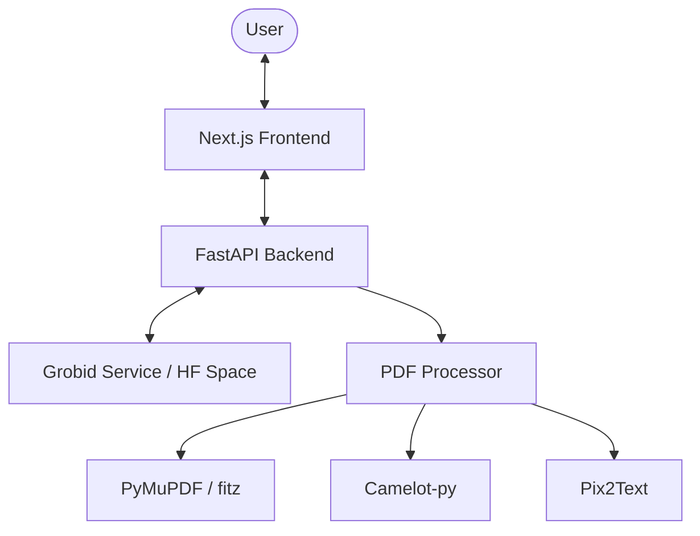

# System Architecture

## 1. High-Level Design

FixMyPaper follows a standard client-server architecture, containerized for easy deployment.

## 2. Component Responsibilities

| Component | Responsibility |
| :--- | :--- |
| **FastAPI** | Request handling, file lifecycle (save/delete), job tracking, and serving results. |
| **PDF Processor** | Orchestrates structural analysis, semantic parsing via GROBID, and rule validation. |
| **Grobid Integration** | Converts PDFs to TEI XML to identify semantic parts (headings, authors, abstract, citations). |
| **Rule Engine** | A collection of `AVAILABLE_CHECKS` (regex, coordinate-based, and semantic) that validate IEEE compliance. |
| **Next.js Frontend** | Provides forms for upload, configuration for "professor" mode (Custom Formats), and result visualization. |

## 3. Core Logic Flow

1. **Ingestion:** PDF uploaded via `/upload`.
2. **Preprocessing:** File saved to `uploads/`. `PDFErrorDetector` is initialized.
3. **Semantic Extraction:** Hits GROBID API (`processFulltextDocument`) to get TEI XML.
4. **Validation:**
   - Text is rebuilt from XML tokens.
   - Sequential checks run against headings, figures, tables, and references.
   - Multi-column coordinate checks for caption placement.
5. **Annotation:** PyMuPDF highlights errors directly in a copy of the PDF.
6. **Delivery:** JSON summary + annotated PDF link returned to frontend.

## 4. Data Storage

- **Short-term:** `uploads/` and `processed/` (disk-based).
- **Persistent Config:** `backend/formats.json` - stores custom formatting profiles.
- **In-memory:** `processing_results` dict in `app.py` (limited scope).

---
*Last Updated: 2026-04-19*
