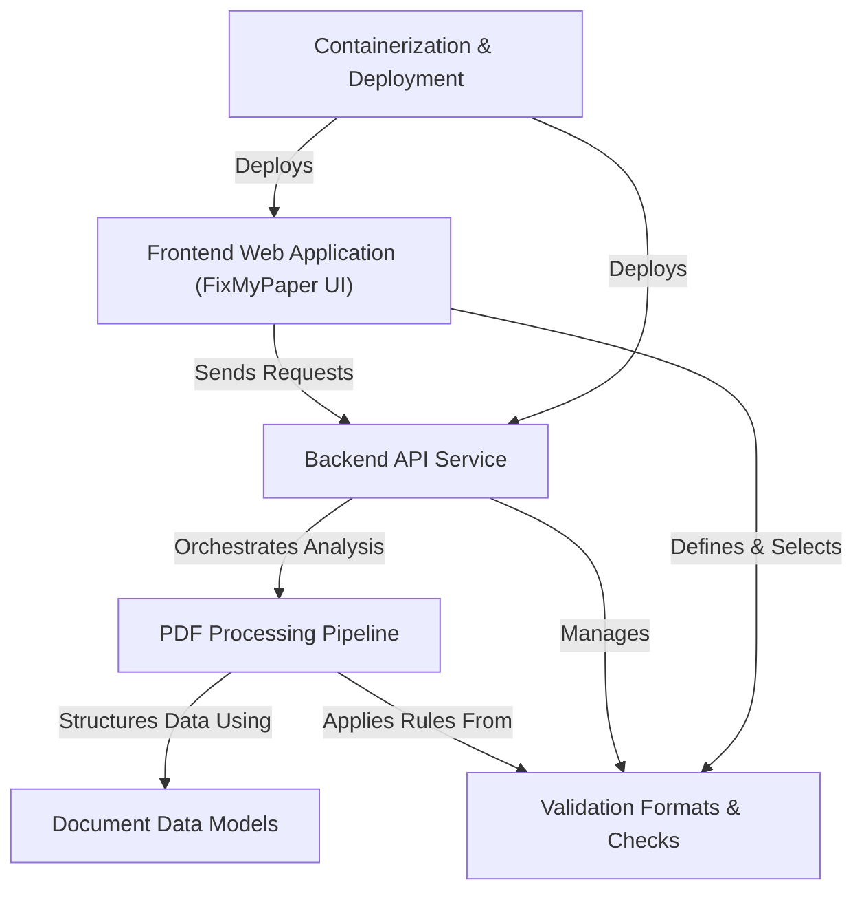

# 📄 FixMyPaper — Research Paper Quality Platform

The `fixmypaper` project is an **academic research quality platform** designed to help students and professors *improve the quality of research papers*. Students can upload their papers to get detailed *quality reports and formatting feedback*, while professors can define and manage *custom submission formats and validation rules*.

## Visual Overview

## Chapters

1. [**Frontend Web Application (FixMyPaper UI)**](docs/01_frontend_web_application__fixmypaper_ui__.md)
   Modern React-based interface for paper submission and interactive reporting.
2. [**Validation Formats & Checks**](docs/02_validation_formats___checks_.md)
   The rule-based engine defining what constitutes a "perfect" paper format.
3. [**Backend API Service**](docs/03_backend_api_service_.md)
   Asynchronous FastAPI service orchestrating the heavy-lifting of PDF analysis.
4. [**PDF Processing Pipeline**](docs/04_pdf_processing_pipeline_.md)
   Deep extraction logic using GROBID, PyMuPDF, and coordinate-based mapping.
5. [**Document Data Models**](docs/05_document_data_models_.md)
   Structured representations of academic papers (Sections, Figures, Tables).
6. [**Containerization & Deployment**](docs/06_containerization___deployment_.md)
   Docker-based orchestration for scaling and easy server deployment.

---
