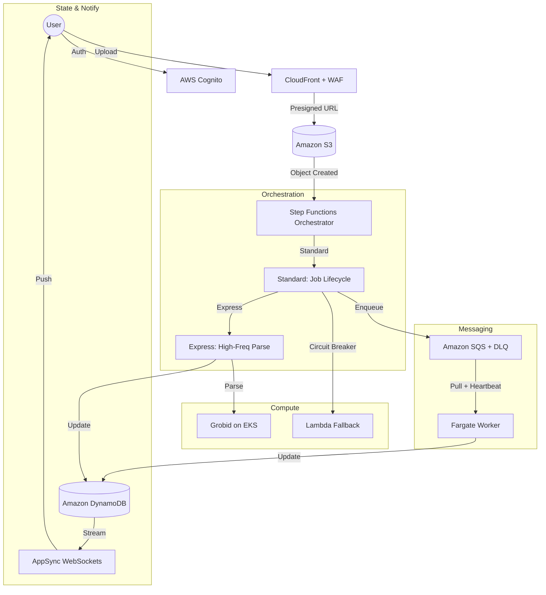

# FixMyPaper 2.0 📄✨

FixMyPaper 2.0 is a **Staff-Level, FAANG-grade**, globally scalable, and event-driven research paper analysis platform built on AWS. 

It has been engineered to move beyond simple API-Worker patterns into a high-availability, resilient ecosystem featuring hybrid state machine orchestration and durable messaging.

---

## 🏗️ Architecture: The "Resilio-Scale" Paradigm



---

## 🚀 Key "Staff-Plus" Features

### 1. Hybrid Orchestration (Standard & Express)
We utilize a dual-workflow model. **Standard workflows** manage long-running job lifecycles and complex error handling, while **Express workflows** handle high-frequency, sub-second parsing tasks to minimize cost and latency.

### 2. Durable Idempotency
Implemented a hashing strategy `sha256(S3_ETag + user_id)` to ensure that duplicate uploads are detected in sub-milliseconds, preventing redundant processing costs for millions of users.

### 3. Visibility Heartbeats
Our workers implement dynamic visibility extension on SQS. For large research papers, the worker periodically "heartbeats" back to SQS, extending the visibility timeout to ensure the job isn't re-processed by another worker before completion.

### 4. Circuit Breaker & Serverless Fallback
If the primary Grobid engine (EKS) reaches a threshold of 5% error rate or >10s latency, the Step Functions orchestrator automatically trips the circuit breaker and routes traffic to a **PyMuPDF-based Lambda Fallback**, providing graceful degradation of service.

---

## 🛠️ Production Stack

- **Frontend**: Next.js 14+ (Vercel)
- **Identity**: AWS Cognito (OIDC / JWT)
- **Orchestration**: AWS Step Functions
- **Messaging**: Amazon SQS (Visibility Heartbeats)
- **Database**: Amazon DynamoDB (State) + Amazon RDS (Analytics)
- **Compute**: Amazon EKS (Grobid) + Amazon Fargate (Workers) + AWS Lambda (Fallback)
- **CI/CD**: GitHub Actions + AWS OIDC (Zero-Trust Pipeline)

---

## ⚡ Quick Start: 2.0 Bootstrap

To provision the production-grade 2.0 environment:

1. **Configure AWS**: Ensure your local AWS profile is active.
   ```bash
   aws configure
   ```
2. **Bootstrap Infrastructure**:
   ```bash
   chmod +x infra/terraform/scripts/bootstrap.sh
   ./infra/terraform/scripts/bootstrap.sh
   ```
3. **Deploy Code**: Push to `main` branch to trigger the OIDC Pipeline.

---

## 🌪️ Resilience Verification
The platform includes an automated **Chaos Engineering Suite** located in `scripts/chaos_suite.sh`. This suite validates:
- [x] Pod termination recovery
- [x] DynamoDB throttling handling
- [x] SQS backpressure & rate-limiting
- [x] Poison pill (malformed PDF) capture via DLQ

---

## 📄 License
MIT © FixMyPaper Team
