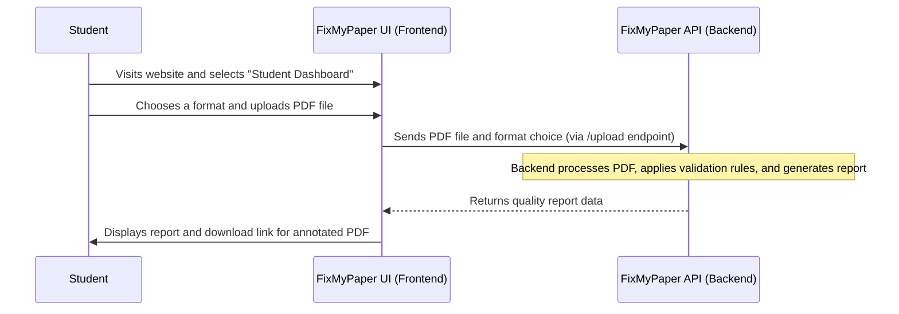

# Chapter 1: Frontend Web Application (FixMyPaper UI)

Welcome to the FixMyPaper tutorial! In this first chapter, we're going to explore the part of our system that you, the user, will interact with directly: the **Frontend Web Application**, also known as the **FixMyPaper UI**.

## 1.1 Your Digital Dashboard: What is the FixMyPaper UI?

Imagine you're driving a car. You don't need to understand how the engine works, how the transmission shifts gears, or how the fuel is injected. All you need are the steering wheel, pedals, and the dashboard with its gauges and buttons.

The FixMyPaper UI is just like that car dashboard and controls! It's the interactive website that users see and use. It provides all the controls and information you need to operate the powerful FixMyPaper system, without needing to worry about the complex "engine" running behind the scenes.

**What problem does it solve?** FixMyPaper helps students and professors ensure research papers meet specific formatting and quality standards. The UI provides a friendly, visual way for you to:
*   **Students:** Upload your research papers, choose which formatting rules to check against, and receive detailed reports on any issues.
*   **Professors:** Define custom submission formats and enable specific checks tailored to your course or department.

Let's walk through a common use case to understand how it works: **A student wants to check their research paper for formatting problems.**

## 1.2 A Student's Journey: Using the FixMyPaper UI

Here’s how a student would use the FixMyPaper UI to get a quality report for their paper:

1.  **Visit the Website:** The student opens their web browser and navigates to the FixMyPaper platform.
2.  **Choose Role:** They select the "Student Dashboard" from the homepage.
3.  **Select a Format:** On the student dashboard, they see options for different submission formats (e.g., "IEEE Conference Template"). They choose the one that applies to their paper.
4.  **Upload Paper:** They click an "Upload PDF" button or drag their research paper PDF file onto the designated area.
5.  **Wait for Processing:** The UI displays a "Processing" message, letting them know the system is analyzing their document.
6.  **View Report:** Once the analysis is complete, a comprehensive "Quality Report" appears directly in their browser. This report highlights all detected formatting issues.
7.  **Download Annotated PDF:** The student can then download a special version of their PDF, with annotations showing exactly where the errors are.

The FixMyPaper UI makes this entire process smooth and intuitive!

## 1.3 Building Blocks of the FixMyPaper UI

Our Frontend Web Application is built using modern web technologies to provide a fast, responsive, and easy-to-use experience. The main technologies are:

*   **Next.js:** A powerful framework for building web applications using React. React helps us create interactive user interfaces (like buttons, forms, and reports). Next.js adds features like routing (navigating between pages) and server-side rendering for better performance.
*   **Tailwind CSS:** A "utility-first" framework for styling our web application. It uses simple class names directly in our HTML-like code to quickly and consistently style elements (colors, spacing, fonts, etc.).

Let's look at some simplified code snippets to see how these pieces work together.

### 1.3.1 Defining the Look and Feel with Tailwind CSS

Tailwind CSS helps us create a consistent design. It's configured in a file like `tailwind.config.js`. Here’s a peek:

```javascript
// frontend/tailwind.config.js
/** @type {import('tailwindcss').Config} */
module.exports = {
  content: [
    "./app/**/*.{js,jsx}", // Scan these folders for Tailwind classes
    "./components/**/*.{js,jsx}",
  ],
  theme: {
    extend: {
      colors: {
        brand: { DEFAULT: "#1d4ed8", dark: "#1e3a8a", light: "#3b82f6" },
        ink: { DEFAULT: "#111827", soft: "#4b5563" },
        // ... more color definitions
      },
      fontFamily: {
        sans: ["Inter", "ui-sans-serif", "system-ui", "-apple-system", "sans-serif"],
      },
      // ... more styling configurations
    },
  },
  plugins: [],
};
```
**Explanation:** This configuration tells Tailwind CSS:
*   Which files (`content`) to look for special class names (like `text-brand-dark` or `bg-blue-50`).
*   What custom colors (`brand`, `ink`) and fonts (`sans`) are available for use across the application.

When we create a button or text, we simply add these class names:

```jsx
// Example from frontend/components/Navbar.jsx
<Link
  href="/student"
  className="px-4 py-2 text-sm font-semibold rounded-lg border border-line text-ink hover:border-brand transition-all"
>
  Student
</Link>
```
**Explanation:** Here, `px-4 py-2` sets padding, `text-sm` sets font size, `rounded-lg` gives rounded corners, and `border border-line` adds a border with a specific color defined in `tailwind.config.js`. `hover:border-brand` makes the border change color when you hover over it. This makes styling very fast and consistent.

### 1.3.2 Pages and Components with Next.js and React

Next.js organizes our application into "pages" and reusable "components."
*   **Pages** are like the different screens a user sees (e.g., the homepage, student dashboard, professor dashboard).
*   **Components** are smaller, reusable pieces of UI (like a navigation bar, a button, or a report card).

Let's look at the main homepage structure:

```jsx
// frontend/app/page.jsx
import Navbar from "@/components/Navbar";
import Hero from "@/components/Hero";
// ... other imports

export default function Home() {
  return (
    <div className="min-h-screen flex flex-col">
      <Navbar /> {/* This is our navigation bar component */}
      <main className="flex-1 max-w-7xl w-full mx-auto px-4 sm:px-6 py-6 flex flex-col gap-6">
        <Hero /> {/* The main "hero" section */}
        <Features /> {/* Section describing features */}
        <Roles /> {/* Section to choose student/professor role */}
        <Coverage /> {/* Section showing check coverage */}
      </main>
      <Footer /> {/* The footer component */}
    </div>
  );
}
```
**Explanation:** This `Home` component defines the layout of our main page. Notice how it uses other smaller components like `Navbar`, `Hero`, `Features`, `Roles`, `Coverage`, and `Footer`. This modular approach makes it easier to build and maintain the UI.

The `frontend/components/Roles.jsx` component, for instance, renders the cards for "Student Dashboard" and "Professor Dashboard":

```jsx
// frontend/components/Roles.jsx
import Link from "next/link"; // Next.js component for navigation

const roles = [
  { tag: "Student Dashboard", title: "Draft Quality Workspace", /* ... */ href: "/student" },
  { tag: "Professor Dashboard", title: "Governance & Format Control", /* ... */ href: "/professor" },
];

export default function Roles() {
  return (
    <section id="roles" className="/* Tailwind CSS classes */">
      {/* ... heading and description ... */}
      <div className="grid sm:grid-cols-2 gap-4">
        {roles.map((r) => (
          <Link key={r.tag} href={r.href} className="group block border /* Tailwind CSS classes */">
            {/* ... content for each role card ... */}
          </Link>
        ))}
      </div>
    </section>
  );
}
```
**Explanation:** This component defines the different roles (Student, Professor) and displays them as clickable cards. The `Link` component from Next.js helps us navigate to different pages (like `/student` or `/professor`) when a user clicks on these cards.

## 1.4 Under the Hood: How the UI Talks to the System

When a student uploads a PDF or a professor creates a new format, the FixMyPaper UI needs to communicate with the "engine" of the system, which is handled by the [Backend API Service](03_backend_api_service_.md). This communication typically happens through "API calls."

Here's a simplified sequence of how a student's PDF upload works:



**Explanation:**
1.  **Student (S)** interacts with the **FixMyPaper UI (F)** through their web browser.
2.  When the student uploads a PDF, the **UI (F)** sends this file (along with the chosen format) to the **FixMyPaper API (B)**. This is like pressing a button on your car dashboard that sends a signal to the engine.
3.  The **API (B)** then does all the heavy lifting, involving other parts of the system like the [PDF Processing Pipeline](04_pdf_processing_pipeline_.md) and applying [Validation Formats & Checks](02_validation_formats___checks_.md).
4.  Once the API is done, it sends back the results (the quality report) to the **UI (F)**.
5.  Finally, the **UI (F)** takes this data and displays it in a user-friendly format for the **Student (S)** to review.

### 1.4.1 Connecting Frontend to Backend

Next.js provides a powerful feature called "rewrites" to help the frontend talk to the backend seamlessly. This means that when the frontend code makes a request to, say, `/api/formats`, Next.js will secretly redirect it to our backend's actual address (e.g., `http://127.0.0.1:7860/api/formats`). This keeps our frontend code clean and independent of the backend's specific location.

Here's how this is configured in `frontend/next.config.mjs`:

```javascript
// frontend/next.config.mjs
/** @type {import('next').NextConfig} */
function getRequiredEnv(name) { /* ... */ } // Helps fetch environment variables

const backendUrl = getRequiredEnv("BACKEND_INTERNAL_URL"); // Gets backend address

const nextConfig = {
  async rewrites() {
    return [
      {
        source: "/api/:path*", // When frontend asks for /api/...
        destination: `${backendUrl}/api/:path*`, // ...send it to backend's /api/...
      },
      {
        source: "/download/:path*", // When frontend asks for /download/...
        destination: `${backendUrl}/download/:path*`, // ...send it to backend's /download/...
      },
    ];
  },
};

export default nextConfig;
```
**Explanation:** This snippet tells Next.js how to "rewrite" certain requests from the UI. For example, if our frontend code tries to fetch data from `/api/formats`, Next.js will internally route that request to the actual backend URL, like `http://127.0.0.1:7860/api/formats`. This is crucial for integrating the two parts of our application.

### 1.4.2 Handling User Input and API Calls

The `frontend/lib/data.js` file contains functions that make these API calls. For example, the `uploadPDF` function handles sending the PDF file to the backend:

```javascript
// frontend/lib/data.js
// ... other helper data

export async function uploadPDF(file, formatId, startPage) {
  const form = new FormData();
  form.append("file", file); // Add the PDF file to the form
  if (formatId) form.append("format_id", formatId); // Add selected format ID
  if (startPage && startPage > 1) form.append("start_page", String(startPage)); // Add start page

  const res = await fetch(`/upload`, { method: "POST", body: form }); // Send to the backend
  if (!res.ok) {
    // ... error handling
    throw new Error(message);
  }
  return res.json(); // Return the JSON response from the backend
}

export function downloadURL(jobId) {
  return `/download/${jobId}`; // Creates a URL to download the annotated PDF
}
// ... more data functions
```
**Explanation:** The `uploadPDF` function prepares the PDF file and other options (like the chosen format and starting page) into a `FormData` object. It then uses the standard `fetch` command to send this data to the `/upload` endpoint, which, as we saw in `next.config.mjs`, is then routed to the backend. The `downloadURL` function helps generate a link to get the annotated PDF back from the backend.

On the student page (`frontend/app/student/page.jsx`), this `uploadPDF` function is used when a file is selected:

```jsx
// frontend/app/student/page.jsx
"use client"; // Marks this as a client-side component

import { useState, useEffect, useCallback } from "react";
// ... other imports
import { fetchFormats, uploadPDF, downloadURL, ERROR_DESCRIPTIONS } from "@/lib/data";

export default function StudentPage() {
  const [phase, setPhase] = useState("upload"); // Keeps track of UI state (upload, processing, results)
  const [error, setError] = useState("");
  const [result, setResult] = useState(null);
  // ... other state variables

  const handleFile = useCallback(async (file) => {
    // ... file validation logic
    setPhase("processing"); // Show "processing" spinner

    try {
      const data = await uploadPDF(file, formatId, startPage); // Call our API function
      if (data.success) {
        setResult(data); // Store the report data
        setPhase("results"); // Show the results
      } else {
        throw new Error("Processing failed");
      }
    } catch (err) {
      setError(err.message);
      setPhase("upload"); // Go back to upload state if error
    }
  }, [formatId, startPage]);

  // ... rest of the component
}
```
**Explanation:** This code snippet shows how our UI manages its state (`phase`) to display different content (upload form, processing spinner, or results report). When the `handleFile` function is called (after a student drops or selects a PDF), it calls the `uploadPDF` function from `lib/data.js` and updates the UI's state based on the outcome.

## 1.5 Conclusion

In this chapter, we've taken our first step into the FixMyPaper project by understanding the **Frontend Web Application (FixMyPaper UI)**. We learned that it's the user-facing part of the system, acting as a digital dashboard to interact with the powerful backend. We explored how students use it to upload papers and get reports, and how professors can define rules. We also got a glimpse of the technologies (Next.js, React, Tailwind CSS) that build this UI and how it communicates with the rest of the FixMyPaper system through API calls and routing.

While the UI makes everything seem simple, there's a lot happening behind the scenes to process your paper and apply formatting rules. In the next chapter, we'll dive into the core of how FixMyPaper understands and applies these rules by exploring [Validation Formats & Checks](02_validation_formats___checks_.md).

---