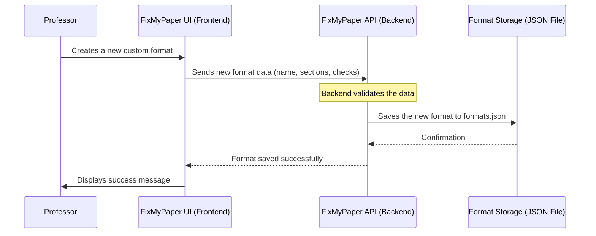
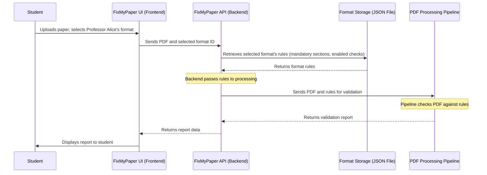

# Chapter 2: Validation Formats & Checks

Welcome back to the FixMyPaper journey! In [Chapter 1: Frontend Web Application (FixMyPaper UI)](01_frontend_web_application__fixmypaper_ui__.md), we explored the digital dashboard—the part of FixMyPaper you see and interact with. You learned how to upload papers and view reports, and how professors can define rules. But what *are* these rules? How does FixMyPaper know what to check for?

That's exactly what we'll uncover in this chapter: **Validation Formats & Checks**. This is the brain of FixMyPaper, where all the rules for evaluating a research paper are defined and managed.

## 2.1 Why Rules Matter: The Customizable Checklist

Imagine you're taking a driving test. You interact with the car (like the FixMyPaper UI), but the examiner has a strict checklist of rules you must follow to pass: "Did you signal correctly?", "Did you stop completely at the stop sign?", "Is your hand position correct?".

FixMyPaper needs a similar "checklist" for academic papers. Research papers often have very specific formatting and structural requirements set by universities, journals, or conferences (like IEEE, APA, MLA, etc.). Trying to remember and manually check every single rule is tedious and prone to human error.

**What problem does it solve?** This part of FixMyPaper creates and applies those customizable "checklists" automatically. It defines:
*   **What a paper *should* contain:** Specific sections (e.g., Abstract, References).
*   **How elements *should* be formatted:** Word counts, label styles, numbering sequences.

Let's focus on a central use case for this chapter: **A professor wants to create a new, custom set of submission guidelines (a "format") for their students, including specific mandatory sections and formatting checks.**

## 2.2 What Are Validation Formats?

In FixMyPaper, a **Validation Format** is essentially a rulebook. It's a predefined set of instructions that tells the system exactly how a research paper should be structured and what quality checks should be applied to it. Think of it as a template or a blueprint for a perfect paper.

Each Validation Format has two main components:

1.  **Mandatory Sections:** These are the essential parts a paper *must* include, like the "Abstract" or "References." If a paper is missing one of these, it's flagged immediately.
2.  **Enabled Checks:** These are the specific, individual rules that FixMyPaper will test against. We'll dive into checks next, but imagine things like "Abstract Word Count" or "Figure Label Format."

This allows institutions and professors to enforce their unique guidelines easily.

## 2.3 Understanding the "Checks": Your Digital Examiner

Individual **Checks** are the specific, granular rules that FixMyPaper can evaluate. They are like the individual items on our driving test checklist. Each check focuses on a particular aspect of a paper's quality or formatting.

Here's how FixMyPaper organizes these checks:

| Category     | Examples of Checks                          | Description                                                                 |
| :----------- | :------------------------------------------ | :-------------------------------------------------------------------------- |
| **Metadata** | Metadata Completeness                       | Checks if title, authors, and publication date are present.                 |
| **Structure**| Abstract Word Count, References Section Exists | Ensures key sections are present and meet basic structural requirements.   |
| **Numbering**| Figure Sequential Numbering, Equation Numbering | Verifies figures, tables, and equations are numbered correctly and sequentially. |
| **Formatting**| Caption Placement                           | Checks if captions for figures are below and tables are above.              |
| **References**| URL & DOI Validity                          | Confirms that URLs and DOIs in references are well-formed.                  |
| **Writing**  | Repeated Words, First-Person Pronouns       | Flags stylistic issues like repetitive language or inappropriate pronouns.  |

These checks are defined in our system, both in the frontend (for displaying options to the user) and the backend (for actually performing the analysis).

Let's look at a simplified example of how some of these checks are defined in our frontend code (`frontend/lib/data.js`):

```javascript
// frontend/lib/data.js (simplified)
export const AVAILABLE_CHECKS = {
  // A check for metadata
  metadata_completeness: {
    name: "Metadata Completeness",
    description: "Title, authors, and publication date are present",
    category: "Metadata",
    error_types: ["metadata_incomplete"],
    default: true, // This check is usually enabled by default
  },
  // A check for abstract structure
  abstract_word_count: {
    name: "Abstract Word Count (150–250 words)",
    description: "Abstract must be between 150 and 250 words",
    category: "Structure",
    error_types: ["abstract_word_count"],
    default: true,
  },
  // A check for figure labels
  figure_label_format: {
    name: "Figure Label Format (Fig. N / Figure N)",
    description: "Figures use 'Fig. N' or 'Figure N' convention",
    category: "Numbering",
    error_types: ["invalid_figure_label"],
    default: true,
  },
};

export const ALL_SECTIONS = [
  "Abstract",
  "Index Terms",
  "Introduction",
  // ... many more sections
  "References",
];
```
**Explanation:**
*   `AVAILABLE_CHECKS`: This is a list of all possible checks FixMyPaper can perform. Each check has a unique ID (like `metadata_completeness`), a display `name`, a `description`, a `category`, and a list of `error_types` it can generate. The `default` property indicates if it should be enabled by default in new formats.
*   `ALL_SECTIONS`: This is a simple list of all section names that can be marked as "mandatory" in a format.

## 2.4 A Professor's Journey: Creating a Custom Format

Let's go through our central use case: Professor Alice wants to create a new format called "My Course Project Submission" for her students.

1.  **Professor Logs In:** Alice goes to the FixMyPaper website and clicks on "Professor Dashboard."
2.  **Navigates to "Create Format":** On her dashboard, she sees a form to create new formats.
3.  **Fills in Details:** She gives the format a name ("My Course Project Submission"), her name ("Prof. Alice"), and a brief description.
4.  **Selects Mandatory Sections:** She checks boxes for sections students *must* include, like "Abstract," "Introduction," "Methodology," and "References."
5.  **Enables Specific Checks:** She browses the list of available checks and enables the ones relevant to her course, such as "Abstract Word Count," "Figure Label Format," and "Reference Format." She might disable "First-Person Pronouns" if her course allows it.
6.  **Saves the Format:** Alice clicks "Save Format."

The FixMyPaper UI then takes all this information and sends it to the [Backend API Service](03_backend_api_service_.md) to be saved. Once saved, this new format becomes available for students to select when they upload their papers!

## 2.5 Under the Hood: How Formats & Checks are Stored

When Professor Alice saves her custom format, the FixMyPaper UI sends the format details to the Backend API. The backend then saves this new format to a special storage location. Later, when a student uploads a paper and selects this format, the backend retrieves these stored rules and applies them.

Here's a simplified sequence of how this process works:



And later, when a student uses this format:



## 2.6 Deep Dive: Code for Formats and Checks

Let's look at how this happens in the code.

### 2.6.1 Frontend: Sending Format Data

The professor's page (`frontend/app/professor/page.jsx`) is responsible for collecting the format details and sending them to the backend. The `handleSave` function is where this happens:

```jsx
// frontend/app/professor/page.jsx (simplified)
import { createFormat } from "@/lib/data"; // Import the function to call the API

export default function ProfessorPage() {
  // ... state variables for form inputs (name, author, sections, checks)
  const [name, setName] = useState("");
  const [author, setAuthor] = useState("");
  const [sections, setSections] = useState(new Set(["Abstract", "Introduction"])); // Example
  const [checks, setChecks] = useState(new Set(["abstract_word_count"])); // Example

  const handleSave = async () => {
    // ... input validation and UI state changes (saving, messages)
    try {
      await createFormat({ // Call the API to save the format
        name: name.trim(),
        created_by: author.trim(),
        mandatory_sections: [...sections], // Convert Set to Array
        enabled_checks: [...checks], // Convert Set to Array
      });
      // ... success message and clearing form
    } catch (err) {
      // ... error handling
    }
  };

  // ... JSX for the form UI
}
```
**Explanation:**
*   The `handleSave` function is triggered when Professor Alice clicks "Save Format."
*   It creates a `payload` object containing all the form data (format `name`, `created_by`, `mandatory_sections`, `enabled_checks`). Note that `Set` objects are converted to arrays (`[...sections]`) as JSON typically uses arrays.
*   This `payload` is then passed to the `createFormat` function, which is a helper in `frontend/lib/data.js` designed to communicate with our backend.

The `createFormat` function in `frontend/lib/data.js` looks like this:

```javascript
// frontend/lib/data.js (simplified)
export async function createFormat(payload) {
  const res = await fetch(`/api/formats`, { // Make a POST request to the backend
    method: "POST",
    headers: { "Content-Type": "application/json" },
    body: JSON.stringify(payload), // Send the format data as JSON
  });
  if (!res.ok) {
    // ... error handling
    throw new Error("Failed to save format");
  }
  return res.json(); // Return the backend's response
}
```
**Explanation:**
*   This function makes a network request (`fetch`) to the `/api/formats` endpoint on our backend.
*   It uses the `POST` method because we are *creating* new data.
*   The `payload` (our format details) is converted into a JSON string and sent in the request `body`.
*   The `if (!res.ok)` block handles any errors returned by the backend.

### 2.6.2 Backend: Receiving and Storing Formats

On the backend (`backend/app.py`), there's a corresponding endpoint to receive and process these requests:

```python
# backend/app.py (simplified)
import json
import uuid
from typing import List
from pathlib import Path
from pydantic import BaseModel, Field
from fastapi import APIRouter, FastAPI, HTTPException
from fastapi.concurrency import run_in_threadpool

# ... other imports and setup

FORMATS_FILE = Path(__file__).parent / "formats.json" # Path to our storage file

class FormatCreateRequest(BaseModel):
    name: str
    created_by: str
    description: str = ""
    mandatory_sections: List[str] = Field(default_factory=list)
    enabled_checks: List[str] = Field(default_factory=list)

# Helper functions to load and save formats to/from the JSON file
def load_formats() -> List[dict]:
    if FORMATS_FILE.exists():
        with open(FORMATS_FILE, encoding="utf-8") as f:
            return json.load(f).get("formats", [])
    return []

def save_formats(formats: List[dict]) -> None:
    with open(FORMATS_FILE, "w", encoding="utf-8") as f:
        json.dump({"formats": formats}, f, indent=2)

router = APIRouter()

@router.post("/api/formats", status_code=201)
async def create_format(data: FormatCreateRequest):
    # ... input validation for name and created_by
    new_fmt = {
        "id": str(uuid.uuid4()), # Generate a unique ID for the new format
        "name": data.name.strip(),
        "created_by": data.created_by.strip(),
        "is_system": False, # Custom formats are not system formats
        "description": data.description.strip(),
        "mandatory_sections": data.mandatory_sections,
        "enabled_checks": data.enabled_checks,
    }
    formats = await run_in_threadpool(load_formats) # Load existing formats
    formats.append(new_fmt) # Add the new format
    await run_in_threadpool(save_formats, formats) # Save all formats back
    return new_fmt # Return the newly created format
```
**Explanation:**
*   `FORMATS_FILE`: This line defines where our formats are stored – a simple JSON file named `formats.json`.
*   `FormatCreateRequest`: This is a Pydantic model that defines the expected structure of the incoming data from the frontend. It ensures that the `name`, `created_by`, `mandatory_sections`, and `enabled_checks` are all present and have the correct types.
*   `load_formats` and `save_formats`: These helper functions handle reading from and writing to our `formats.json` file. `run_in_threadpool` is used to make sure these file operations don't block the main server.
*   `@router.post("/api/formats")`: This decorator tells FastAPI (our backend framework) that this function should be called when a `POST` request is made to `/api/formats`.
*   Inside `create_format`:
    *   A unique `id` is generated for the new format.
    *   The data from the request (`data`) is used to create a `new_fmt` dictionary.
    *   It loads all existing formats, adds the new one, and saves the updated list back to `formats.json`.

Here’s an example of what `backend/formats.json` might look like after Professor Alice saves her format, alongside the default system format:

```json
// backend/formats.json (simplified)
{
  "formats": [
    {
      "id": "ieee_standard",
      "name": "IEEE Standard",
      "created_by": "System",
      "is_system": true,
      "description": "Standard IEEE conference / journal paper format.",
      "mandatory_sections": [
        "Abstract", "Introduction", "References"
      ],
      "enabled_checks": [
        "metadata_completeness",
        "abstract_word_count",
        // ... many more enabled checks
      ]
    },
    {
      "id": "a1b2c3d4-e5f6-7890-abcd-1234567890ef",
      "name": "My Course Project Submission",
      "created_by": "Prof. Alice",
      "is_system": false,
      "description": "Guidelines for Fall 2024 Project.",
      "mandatory_sections": [
        "Abstract", "Introduction", "Methodology", "References"
      ],
      "enabled_checks": [
        "abstract_word_count",
        "figure_label_format",
        "reference_format"
      ]
    }
  ]
}
```
**Explanation:**
*   The file contains a list of format objects.
*   The `ieee_standard` is a built-in `is_system: true` format.
*   Professor Alice's `My Course Project Submission` is now listed with its unique ID, chosen sections, and enabled checks.

### 2.6.3 PDF Processing: Applying the Checks

Finally, when a student uploads their paper and selects Professor Alice's format, the `run_validation_pipeline` function in our [Backend API Service](03_backend_api_service_.md) will load the enabled checks and mandatory sections defined in that format.

The `backend/pdf_processor.py` module is where the actual logic for *performing* each check resides. It contains functions like `_check_abstract_exists()` or `_check_figure_label_format()`. For example, a simplified `_check_abstract_exists` function might look like this:

```python
# backend/pdf_processor.py (simplified)
import re
from typing import List, Dict

@dataclass
class ErrorInstance:
    # ... simplified definition

class PDFErrorDetector:
    def __init__(self, start_page: int = 1):
        self.full_text = "" # This would be populated from the PDF
        self.line_info: List = [] # This would be populated from the PDF
        self._grobid_has_abstract: bool = False # Populated by GROBID

    # ... other extraction and helper methods

    def _check_abstract_exists(self) -> List[ErrorInstance]:
        """
        Verify the paper contains an Abstract section.
        Uses GROBID's structural signal first, then falls back to regex.
        """
        if self._grobid_has_abstract: # Check if GROBID detected an abstract
            return [] # No error

        # Fallback: simple text search if GROBID didn't find it
        if re.search(r"\bAbstract\b", self.full_text, re.IGNORECASE):
            return [] # No error

        # If still not found, return an error
        first_page = self.line_info[0][2] if self.line_info else 0
        return [ErrorInstance(
            check_id=1,
            check_name="Abstract Missing",
            description="No Abstract section found.",
            page_num=first_page,
            text="[Abstract section not found]",
            bbox=(0,0,200,20), # Dummy bbox for first page
            error_type="missing_abstract",
        )]

    def _check_required_sections(self, required: List[str]) -> List[ErrorInstance]:
        """
        Verify that every section in `required` is present.
        This uses our `SECTION_DETECTION_KEYWORDS` and GROBID data.
        """
        errors = []
        # ... logic to check each required section against extracted data
        return errors
```
**Explanation:**
*   `PDFErrorDetector`: This class contains all the logic for checking a PDF.
*   `_check_abstract_exists()`: This is an example of a specific check function. It first tries to use a more reliable signal (like `_grobid_has_abstract` from an advanced PDF parsing tool) and then falls back to simpler text pattern matching. If the abstract isn't found, it creates an `ErrorInstance` which describes the problem.
*   `_check_required_sections()`: This function, called by the pipeline, iterates through all sections marked as "mandatory" in the selected format and verifies their presence in the document using keywords and structural analysis.

These individual checks and section requirements are then combined, and the results are presented to the student in a clear report.

## 2.7 Conclusion

In this chapter, we've explored the crucial role of **Validation Formats & Checks** in the FixMyPaper system. We learned that these define the rules and standards for evaluating research papers, acting like a customizable checklist. We saw how professors can create custom formats by selecting mandatory sections and enabling specific checks, and how these definitions are stored and used by the system during PDF processing.

This detailed rulebook is what allows FixMyPaper to automatically analyze documents and provide precise feedback. But how does this all connect to the central "engine" of FixMyPaper that orchestrates everything? In the next chapter, we'll dive into the [Backend API Service](03_backend_api_service_.md), which is responsible for coordinating between the UI, the formats, and the actual PDF processing.

---
