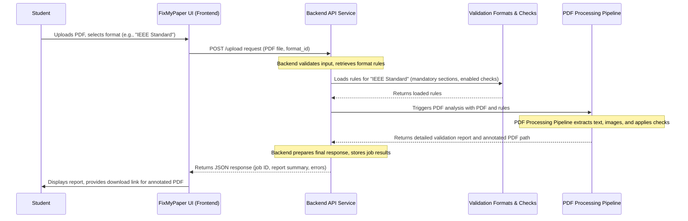

# Chapter 3: Backend API Service

Welcome back to the FixMyPaper journey! In [Chapter 1: Frontend Web Application (FixMyPaper UI)](01_frontend_web_application__fixmypaper_ui__.md), we interacted with the user-friendly dashboard. In [Chapter 2: Validation Formats & Checks](02_validation_formats___checks_.md), we learned about the customizable rulebooks that tell FixMyPaper what to look for. But how do these pieces connect? How does the UI send your paper, and how do the rules get applied to it?

That's where the **Backend API Service** comes in! This is the "brain" and the "engine room" of the entire FixMyPaper system. It's the central hub that receives all requests, orchestrates tasks, and sends back results.

## 3.1 The Brain and Engine: What is the Backend API Service?

Imagine your car again. You interact with the dashboard (the UI) by pressing buttons or turning the steering wheel. But none of that would work without the engine, the transmission, and the onboard computer working together behind the scenes. These components receive your commands, do the heavy lifting, and make the car move.

The FixMyPaper **Backend API Service** is exactly like that! It's the central computer and the engine, built with **Python** and a powerful framework called **FastAPI**. It doesn't have a visual interface that you see directly, but it's constantly working to:

*   **Receive requests:** When you click "Upload PDF" or "Save Format" in the UI, the UI sends a request to the Backend.
*   **Process data:** It takes your uploaded paper, retrieves the chosen validation rules, and sends them off for analysis.
*   **Orchestrate tasks:** It coordinates with other parts of the system, like the [PDF Processing Pipeline](04_pdf_processing_pipeline_.md), to get the actual work done.
*   **Return results:** Once the processing is complete, it collects the validation report and sends it back to the UI to be displayed to you.

**What problem does it solve?** The Backend API Service makes FixMyPaper functional. It handles all the complex logic, data management, and heavy computational tasks, ensuring the frontend remains fast and user-friendly. It allows different parts of the system (like the UI and the PDF processor) to "talk" to each other in a structured way.

Let's focus on our core use case: **A student uploads their research paper to the FixMyPaper UI, and the Backend API processes it and returns a detailed quality report.**

## 3.2 How the Backend API Works: Requests and Endpoints

Think of a restaurant:
*   You, the user, are the **customer**.
*   The menu is like the **API** (Application Programming Interface) – it lists all the things you can order (requests you can make) and what you expect to get back (responses).
*   Each item on the menu (e.g., "Upload Paper," "Create Format") is called an **endpoint**. It's a specific address the UI uses to ask the backend to do something.
*   The kitchen (our backend) prepares your order and brings it back.

In FixMyPaper, the Frontend UI sends **HTTP requests** (like ordering from the menu) to specific **endpoints** on the Backend API. The Backend then performs actions and sends back **HTTP responses** (like delivering your order).

Our Backend API is built using:
*   **Python:** A versatile and readable programming language.
*   **FastAPI:** A modern, fast (hence the name!) web framework for building APIs in Python. It helps us easily define endpoints and handle data.

### 3.2.1 Example: The `/upload` Endpoint

When a student uploads a PDF, the UI makes a `POST` request to the `/upload` endpoint. This request includes the PDF file itself and the ID of the chosen validation format.

Here's how this looks in the `backend/app.py` file, where our FastAPI application is defined:

```python
# backend/app.py (simplified)
from fastapi import FastAPI, UploadFile, Form # Import necessary components
from fastapi.middleware.cors import CORSMiddleware
# ... other imports and setup

app = FastAPI(title="Research Paper Error Checker") # Create our API application
app.add_middleware(
    CORSMiddleware, # Allows frontend and backend to talk
    allow_origins=["*"],
    allow_credentials=True,
    allow_methods=["*"],
    allow_headers=["*"],
)

# This is our upload endpoint!
@app.post("/upload", responses={400: {"model": ErrorResponse}, 500: {"model": ErrorResponse}})
async def upload_file(
    file: UploadFile = File(...), # The uploaded PDF file
    format_id: str = Form(default=""), # The ID of the selected format
    start_page: int = Form(default=1), # Optional starting page for analysis
):
    # ... backend logic to handle the upload ...
    pass # We'll fill this in next!
```
**Explanation:**
*   `app = FastAPI(...)`: This line creates our FastAPI application instance.
*   `app.add_middleware(CORSMiddleware, ...)`: This is important for security and allowing our frontend (running on one address) to communicate with our backend (running on another address).
*   `@app.post("/upload")`: This is a "decorator" that tells FastAPI: "Whenever a `POST` request comes to the `/upload` address, call the `upload_file` function below."
*   `file: UploadFile = File(...)`: This tells FastAPI to expect an uploaded file named `file`.
*   `format_id: str = Form(default="")`: This tells FastAPI to expect a text field named `format_id`.
*   `start_page: int = Form(default=1)`: This expects an integer `start_page` from the form.

These type hints (like `UploadFile`, `str`, `int`) are a key feature of FastAPI and Python that make it easy to automatically validate the incoming data.

## 3.3 A Student's Journey (Revisited): How the Backend Orchestrates

Let's trace how the Backend API Service makes our central use case (student uploads paper, gets report) happen.


**Explanation:**
1.  **Student (S)** interacts with the **Frontend (F)**.
2.  The **Frontend (F)** sends the PDF and the `format_id` to the **Backend API Service (B)** via the `/upload` endpoint.
3.  The **Backend (B)** uses the `format_id` to fetch the specific rules (mandatory sections, enabled checks) from the **Validation Formats & Checks (C)** system (which we discussed in [Chapter 2: Validation Formats & Checks](02_validation_formats___checks_.md)).
4.  With the PDF and the rules in hand, the **Backend (B)** then passes them to the **PDF Processing Pipeline (P)**. This is where the real heavy lifting of analyzing the PDF happens (we'll dive into this in the next chapter!).
5.  The **PDF Processing Pipeline (P)** does its work and returns the complete validation report (errors, statistics, etc.) back to the **Backend (B)**.
6.  The **Backend (B)** packages this information into a user-friendly format, stores the results temporarily for later download, and sends it back to the **Frontend (F)**.
7.  Finally, the **Frontend (F)** displays the report to the **Student (S)**.

## 3.4 Under the Hood: The Backend's Code in Detail

Let's look at the `upload_file` function in `backend/app.py` more closely to see how it performs these orchestration steps.

### 3.4.1 Receiving and Saving the Uploaded File

First, the backend receives the file and saves it temporarily:

```python
# backend/app.py (simplified - inside upload_file function)
import os
import uuid
from pathlib import Path
from werkzeug.utils import secure_filename # For safe filenames
from fastapi import File, Form, UploadFile, HTTPException
from fastapi.concurrency import run_in_threadpool # For non-blocking file operations

UPLOAD_FOLDER = "uploads" # Folder to save original PDFs
PROCESSED_FOLDER = "processed" # Folder for annotated PDFs
MAX_CONTENT_LENGTH = 50 * 1024 * 1024 # 50 MB file limit

# ... (rest of the upload_file function)

    if not file.filename:
        raise HTTPException(status_code=400, detail="No file selected")
    if not allowed_file(file.filename): # Helper to check if it's a PDF
        raise HTTPException(status_code=400, detail="Only PDF files are allowed")

    job_id = str(uuid.uuid4()) # Generate a unique ID for this job
    original_filename = secure_filename(file.filename) # Clean filename for security
    input_path = os.path.join(UPLOAD_FOLDER, f"{job_id}_{original_filename}") # Path to save input

    data = await file.read() # Read the entire file content
    if len(data) > MAX_CONTENT_LENGTH:
        raise HTTPException(status_code=400, detail="File exceeds 50MB size limit")
    await run_in_threadpool(Path(input_path).write_bytes, data) # Save the file
```
**Explanation:**
*   It performs basic checks: Is a file provided? Is it a PDF?
*   A `job_id` (a unique identifier) is generated for each upload. This ID will be used to track the processing and retrieve results later.
*   The `original_filename` is "secured" to prevent malicious file names.
*   The uploaded PDF (`file.read()`) is saved to the `UPLOAD_FOLDER` with its `job_id` prepended to ensure uniqueness. `run_in_threadpool` makes sure this file operation doesn't slow down other requests.

### 3.4.2 Loading Validation Rules

Next, if a specific `format_id` was provided by the user, the backend loads the corresponding validation rules:

```python
# backend/app.py (simplified - inside upload_file function)
from backend.pdf_processor import AVAILABLE_CHECKS # All possible checks
from backend.app import load_formats # Our helper to load saved formats (from Chapter 2)

# ... (previous code)

    required_sections: List[str] = []
    enabled_check_types: Optional[set[str]] = None

    if format_id:
        formats = await run_in_threadpool(load_formats) # Load all saved formats
        fmt = next((f for f in formats if f["id"] == format_id), None) # Find the selected format
        if fmt:
            required_sections = fmt.get("mandatory_sections", []) # Get mandatory sections
            enabled_checks = fmt.get("enabled_checks", []) # Get enabled checks
            if enabled_checks:
                # Convert check IDs to their underlying error types
                types = {"missing_required_section"}
                for cid in enabled_checks:
                    if cid in AVAILABLE_CHECKS:
                        types.update(AVAILABLE_CHECKS[cid]["error_types"])
                enabled_check_types = types
```
**Explanation:**
*   If a `format_id` is present, the backend uses `load_formats()` (which reads `formats.json` as seen in [Chapter 2: Validation Formats & Checks](02_validation_formats___checks_.md)) to find the specific format.
*   It then extracts the `mandatory_sections` (e.g., "Abstract", "References") and `enabled_checks` (e.g., "abstract_word_count") from that format.
*   `enabled_check_types` is built to tell the processing pipeline exactly which *types* of errors to look for. This makes the validation highly customizable.

### 3.4.3 Kicking off the PDF Processing Pipeline

This is where the Backend delegates the core work to the [PDF Processing Pipeline](04_pdf_processing_pipeline_.md):

```python
# backend/app.py (simplified - inside upload_file function)
from backend.pipeline import run_validation_pipeline # The function that runs the pipeline
from backend.validation_models import ValidationIssue, ValidationSummary # Data models for results

# ... (previous code)

        # Output path for the annotated PDF
        output_filename = f"annotated_{original_filename}"
        output_path = os.path.join(PROCESSED_FOLDER, f"{job_id}_{output_filename}")

        errors: List[ValidationIssue] = []
        summary = ValidationSummary(errors=0, pages_with_errors=0, figures=0, tables=0)
        statistics: Dict[str, Any] = {}
        extracted_data: Dict[str, Any] = {}
        reference_analysis: Dict[str, Any] = {}
        pipeline_success = True

        try:
            pipeline_result = await run_in_threadpool(
                run_validation_pipeline, # This is the magic call!
                input_path,              # The uploaded PDF
                output_path,             # Where to save the annotated PDF
                required_sections or None, # Sections to check for
                enabled_check_types,     # Specific checks to run
                safe_start_page,         # Starting page for analysis
                job_id,
                original_filename,
            )
            # Collect results from the pipeline
            errors = pipeline_result.errors
            summary = pipeline_result.summary
            statistics = pipeline_result.statistics
            extracted_data = pipeline_result.extracted_data
            reference_analysis = pipeline_result.reference_analysis
            pipeline_success = pipeline_result.success
        except Exception as proc_exc:
            # ... error handling for pipeline failures ...
            pipeline_success = False
            # ... set default error information ...
```
**Explanation:**
*   `output_path`: This is where the annotated PDF (the one with highlighted errors) will be saved.
*   `await run_in_threadpool(run_validation_pipeline, ...)`: This is the core call. The `run_validation_pipeline` function (from `backend/pipeline.py`) is where all the complex PDF parsing and validation logic resides. `run_in_threadpool` ensures that this potentially long-running process doesn't block other incoming requests to the API.
*   The `pipeline_result` object contains all the information generated by the pipeline, which the backend then collects.

### 3.4.4 Storing and Returning Results

Finally, the backend stores the comprehensive results using the `job_id` and constructs the response for the frontend:

```python
# backend/app.py (simplified - inside upload_file function)
from datetime import datetime
from backend.app import processing_results # Global dictionary to store job results
from backend.app import _build_document_overview # Helper to create a brief summary
from backend.app import UploadResponse # Pydantic model for the response

# ... (previous code)

        json_path = os.path.join(PROCESSED_FOLDER, f"{job_id}_extracted_data.json")

        def _write_extracted_json() -> None:
            with open(json_path, "w", encoding="utf-8") as jf:
                json.dump(extracted_data, jf, indent=2, ensure_ascii=False)

        await run_in_threadpool(_write_extracted_json) # Save detailed extraction data

        processing_results[job_id] = { # Store all results for this job
            "job_id": job_id,
            "original_filename": original_filename,
            "output_filename": output_filename,
            "input_path": input_path,
            "output_path": output_path,
            "start_page": safe_start_page,
            "summary": summary.model_dump(),
            "errors": [e.model_dump() for e in errors],
            "error_count": summary.errors,
            "statistics": statistics,
            "reference_analysis": reference_analysis,
            "mandatory_sections": required_sections,
            "document_overview": _build_document_overview( # Generate summary for UI
                extracted_data, original_filename, statistics, summary.errors
            ),
            "pipeline_success": pipeline_success,
            "pipeline_error": pipeline_error_message,
            "processed_at": datetime.now().isoformat(),
        }

        return UploadResponse( # Send structured response back to frontend
            job_id=job_id,
            original_filename=original_filename,
            output_filename=output_filename,
            summary=summary,
            error_count=summary.errors,
            errors=errors,
            statistics=statistics,
            reference_analysis=reference_analysis,
            mandatory_sections=required_sections,
            document_overview=processing_results[job_id]["document_overview"],
            start_page=safe_start_page,
            success=pipeline_success,
        )
```
**Explanation:**
*   `processing_results[job_id] = { ... }`: The entire set of results (summary, errors, statistics, file paths) for this `job_id` is stored in a dictionary. This allows the frontend to request results or the annotated PDF later using just the `job_id`.
*   `return UploadResponse(...)`: FastAPI automatically converts this `UploadResponse` object (which uses Pydantic models for structured data) into a JSON response that the frontend can easily read. It contains the `job_id` and all the report data needed to display to the user.

### 3.4.5 Other Important Backend Endpoints

Besides `/upload`, the Backend API Service handles other crucial tasks:

| Endpoint                  | HTTP Method | Description                                                                                               |
| :------------------------ | :---------- | :-------------------------------------------------------------------------------------------------------- |
| `/api/formats`            | `GET`       | Retrieves a list of all available [Validation Formats & Checks](02_validation_formats___checks_.md).      |
| `/api/formats`            | `POST`      | Allows a professor to **create** a new custom validation format. (As seen in Chapter 2)                   |
| `/api/formats/{fmt_id}`   | `DELETE`    | Allows a professor to **delete** a custom validation format (e.g., if a course is over).                  |
| `/download/{job_id}`      | `GET`       | Allows the frontend to request the processed (annotated) PDF file for a specific `job_id`.                |
| `/results/{job_id}`       | `GET`       | Allows the frontend to retrieve the detailed JSON report for a specific `job_id` if it needs to refresh.  |
| `/health`                 | `GET`       | A simple check to see if the backend service is running correctly.                                        |

These endpoints are all defined in `backend/app.py` using similar `@router.get`, `@router.post`, or `@router.delete` decorators.

## 3.5 How the Backend API Runs

The Backend API is a Python application that needs to be "served" by a web server to handle requests from the internet. We use `gunicorn` and `uvicorn` for this.

You can see this in the `Procfile` and `Dockerfile` for our project:

```yaml
# Procfile
web: gunicorn --worker-class uvicorn.workers.UvicornWorker backend.app:app --bind 0.0.0.0:$PORT --timeout 120
```
```dockerfile
# Dockerfile.backend (simplified)
# ... other setup ...
EXPOSE 7860
CMD ["gunicorn", "--worker-class", "uvicorn.workers.UvicornWorker", "--bind", "0.0.0.0:7860", "--workers", "2", "--timeout", "300", "backend.app:app"]
```
**Explanation:**
*   `gunicorn` is a "production-ready" web server that manages multiple `uvicorn` "workers."
*   `uvicorn.workers.UvicornWorker` is specifically designed to run FastAPI applications very efficiently.
*   `backend.app:app` tells `gunicorn` where to find our FastAPI application (`app` variable inside `backend/app.py`).
*   `--bind 0.0.0.0:$PORT` means it listens on all available network interfaces at the specified port, making it accessible.
*   `--timeout 120` (or `300` in Docker) sets how long a request can take before timing out, important for long-running PDF processing tasks.

This setup ensures our Backend API is robust and ready to handle many users, forming a key part of our [Containerization & Deployment](06_containerization___deployment_.md) strategy.

## 3.6 Conclusion

In this chapter, we've uncovered the **Backend API Service**, the central nervous system and engine of the FixMyPaper project. We learned how it uses Python and FastAPI to receive requests from the frontend, orchestrate complex tasks like loading validation rules, triggering PDF analysis via the [PDF Processing Pipeline](04_pdf_processing_pipeline_.md), and returning detailed reports. We explored how different endpoints allow the UI to perform various actions, from uploading papers to managing custom formats.

Understanding the Backend API is crucial because it's where the "magic" happens, coordinating all the sophisticated components. But what exactly happens *inside* the [PDF Processing Pipeline](04_pdf_processing_pipeline_.md) when the backend calls it? That's what we'll explore next!

[Chapter 4: PDF Processing Pipeline](04_pdf_processing_pipeline_.md)

---