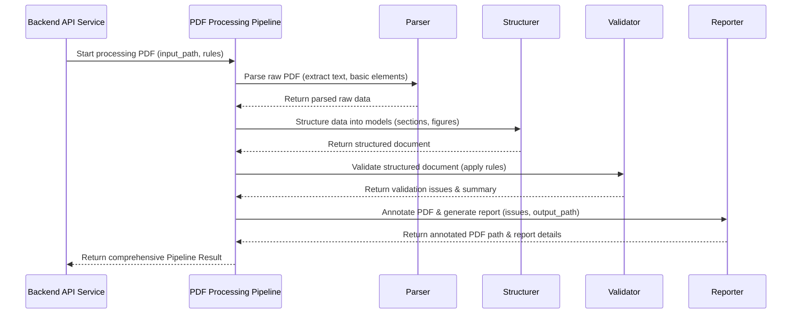

# Chapter 4: PDF Processing Pipeline

Welcome back to the FixMyPaper journey! In [Chapter 3: Backend API Service](03_backend_api_service_.md), we learned that the Backend API acts as the "brain" of our system, receiving requests and orchestrating tasks. One of its most important jobs is to kick off the detailed analysis of your PDF paper.

But how does FixMyPaper actually *read* your PDF, *understand* its structure, *apply* all those [Validation Formats & Checks](02_validation_formats___checks_.md), and then *mark up* the errors? That's the heavy lifting done by the **PDF Processing Pipeline**!

## 4.1 The Paper Factory: What is the PDF Processing Pipeline?

Imagine you've submitted a raw material (your PDF paper) to a factory. This factory has several specialized stations, each performing a specific task to transform that raw material into a polished, quality-controlled product (a detailed report with annotations).

The **PDF Processing Pipeline** is exactly like that automated factory assembly line for your paper! It's the core logic that takes your raw PDF document and systematically transforms it into a structured analysis report. It's designed to be robust and handle complex academic paper layouts.

**What problem does it solve?** PDF documents are notoriously difficult for computers to understand. They are designed for human readability, not machine parsing. The pipeline solves this by:
*   **Breaking down the PDF:** Extracting text, figures, tables, and equations from the visual layout.
*   **Making sense of the data:** Organizing this extracted information into meaningful structures.
*   **Checking for compliance:** Running the predefined validation rules against the structured data.
*   **Providing clear feedback:** Generating a report and marking errors directly on the PDF.

Our central use case for this chapter is: **A student uploads a research paper PDF, and the PDF Processing Pipeline analyzes it and produces a report highlighting formatting issues and an annotated PDF.**

## 4.2 How the Pipeline Works: The Assembly Line Steps

The PDF Processing Pipeline consists of several distinct, sequential stages. Each stage takes the output of the previous stage and performs its specific job.

Here are the key stages:

| Stage                 | What it Does                                                                                                                                                                                                         | Analogy                 |
| :-------------------- | :------------------------------------------------------------------------------------------------------------------------------------------------------------------------------------------------------------------- | :---------------------- |
| **1. Parsing**        | **Reads the PDF** document, extracts all raw text, page by page, and uses advanced tools like GROBID to identify basic elements (sections, figures, tables, equations) and metadata.                                 | Initial Material Sort   |
| **2. Structuring**    | **Organizes the raw data** from parsing into a clear, computer-readable format using predefined [Document Data Models](05_document_data_models_.md). It identifies specific sections, figures, tables, and equations. | Component Assembly      |
| **3. Validation**     | **Applies the rules** from the selected [Validation Formats & Checks](02_validation_formats___checks_.md). It goes through each structured element (e.g., figure, section) and checks it against the rules.          | Quality Control         |
| **4. Reporting & Annotation** | **Generates the final report** summarizing all detected issues and statistics. It also creates a *new* version of the PDF with visual highlights (annotations) directly on the problematic areas.        | Final Inspection & Labeling |

Let's visualize this flow:



## 4.3 Running the Pipeline: A Simple Call

From the perspective of the [Backend API Service](03_backend_api_service_.md), starting the entire pipeline is as simple as calling one main function: `run_validation_pipeline`.

This function is defined in `backend/pipeline.py` and takes the PDF file path, the desired output path for the annotated PDF, the required sections, and the enabled checks as input.

Here's a simplified look at how the `run_validation_pipeline` function is called:

```python
# backend/pipeline.py (simplified)
from typing import List, Optional, Sequence, Set
from backend.validation_models import PipelineResult, ValidationIssue
from backend.parser import parse_pdf
from backend.validator import validate_document
from backend.reporting import annotate_pdf

def run_validation_pipeline(
    pdf_path: str,
    output_path: Optional[str] = None,
    required_sections: Optional[Sequence[str]] = None,
    enabled_check_types: Optional[Set[str]] = None,
    start_page: int = 1,
    job_id: str = "",
    original_filename: str = "",
) -> PipelineResult:
    # 1. Parsing: Extract raw text and elements
    parsed_document = parse_pdf(pdf_path, start_page=start_page)

    # 2. Structuring & 3. Validation: Build structured document and apply checks
    validation_result = validate_document(parsed_document, required_sections=required_sections)

    # Filter issues based on enabled checks from the selected format
    filtered_issues = _filter_issues(validation_result.errors, enabled_check_types)

    # 4. Reporting & Annotation: Create the annotated PDF
    if output_path:
        annotate_pdf(pdf_path, output_path, filtered_issues)

    # ... package results into a PipelineResult object ...
    return PipelineResult(
        job_id=job_id,
        original_filename=original_filename,
        output_path=output_path or pdf_path,
        success=True,
        summary=validation_result.summary,
        errors=filtered_issues,
        document=validation_result.document,
        # ... other data ...
    )
```
**Explanation:**
*   The `run_validation_pipeline` function is the orchestrator. It receives the path to your uploaded PDF (`pdf_path`), where to save the result (`output_path`), and the rules (`required_sections`, `enabled_check_types`).
*   It then calls specialized functions for each stage: `parse_pdf`, `validate_document`, and `annotate_pdf`.
*   Finally, it gathers all the information (summary, errors, structured document) and returns it as a `PipelineResult` object to the Backend API.

Let's dive deeper into each stage to see how they work.

## 4.4 Stage 1: Parsing the PDF

The first step is to transform the visual content of a PDF into text and basic elements a computer can start to understand. For this, FixMyPaper leverages powerful tools, including:
*   **PyMuPDF (fitz):** A fast PDF library for basic text and layout extraction.
*   **GROBID:** A machine learning-based system that parses academic PDFs to extract structured information like titles, authors, sections, figures, tables, and references. It's very smart at understanding the *semantic* meaning.
*   **Camelot:** A Python library specifically designed for extracting tables from PDFs.

The `backend/parser.py` module is responsible for this stage. It acts as a wrapper, using `PDFErrorDetector` (an internal helper that integrates GROBID and Camelot) to get the raw text and element candidates.

```python
# backend/parser.py (simplified)
import fitz # PyMuPDF
from backend.pdf_processor import PDFErrorDetector
from backend.validation_models import ParsedDocument, ExtractionLine, SectionBlock, ElementCandidate, BoundingBox

def _bbox_from_tuple(value: tuple) -> BoundingBox:
    # Helper to convert a tuple (x0, y0, x1, y1) into a BoundingBox object
    x0, y0, x1, y1 = value
    return BoundingBox(x0=float(x0), y0=float(y0), x1=float(x1), y1=float(y1))

def parse_pdf(pdf_path: str, start_page: int = 1) -> ParsedDocument:
    detector = PDFErrorDetector(start_page=start_page) # Initializes the extraction tools
    doc = fitz.open(pdf_path) # Opens the PDF file

    # --- Core extraction calls ---
    detector._extract_with_grobid(pdf_path) # Uses GROBID for advanced parsing
    detector._extract_all_text(doc) # Gathers all text, falling back to PyMuPDF if GROBID fails
    detector._extract_tables(pdf_path) # Uses Camelot for table extraction

    # ... additional metadata and reference extraction ...
    
    # --- Convert raw extracted data into structured ParsedDocument ---
    lines = [
        ExtractionLine(text=text, page=page_num + 1, bbox=_bbox_from_tuple(bbox))
        for text, bbox, page_num in detector.line_info
    ]
    
    section_heads = [ # GROBID-identified section headings
        SectionBlock(
            heading=head["text"].strip(),
            page=head["page"] + 1,
            bbox=_bbox_from_tuple(head["bbox"]),
        ) for head in detector._grobid_section_heads
    ]
    
    figure_candidates = [] # Populate from detector._grobid_figure_entries
    table_candidates = []  # Populate from detector.extracted_tables
    equation_candidates = [] # Populate from detector._grobid_equations or line scan

    parsed = ParsedDocument(
        raw_text=detector.full_text,
        lines=lines,
        section_heads=section_heads,
        element_candidates=[*figure_candidates, *table_candidates, *equation_candidates],
        # ... other extracted data like metadata, references, statistics ...
        page_count=len(doc),
    )
    doc.close()
    return parsed
```
**Explanation:**
*   `parse_pdf` initializes `PDFErrorDetector`, which is our heavy-duty extraction engine.
*   `detector._extract_with_grobid(pdf_path)`: This is where GROBID does its magic, sending the PDF to a GROBID server and getting back a highly structured XML (TEI) representation. This XML is a treasure trove of information about sections, figures, and metadata.
*   `detector._extract_all_text(doc)`: This rebuilds the document's text content, line by line, using the precise coordinates provided by GROBID. If GROBID fails, it falls back to PyMuPDF for basic text.
*   `detector._extract_tables(pdf_path)`: This uses Camelot to find and extract tables.
*   Finally, all this raw, extracted data is organized into a `ParsedDocument` object, which represents the PDF in a preliminary structured format. This `ParsedDocument` is then passed to the next stage.

## 4.5 Stage 2: Structuring Data

After parsing, we have a `ParsedDocument` containing raw text, lines, and "candidate" elements. The structuring stage refines these candidates into definitive, semantically rich [Document Data Models](05_document_data_models_.md) like `StructuredElement` and `StructuredDocument`. This is where we strictly identify figures, tables, and equations with their numbers and labels.

This stage is handled by functions in `backend/detector.py` and `backend/validator.py`.

```python
# backend/detector.py (simplified)
import re
from typing import List, Optional
from backend.validation_models import ElementCandidate, StructuredDocument

# Regular expressions to strictly identify figures, tables, equations
FIGURE_LABEL_RE = re.compile(r"\b(?:Fig\.?|Figure)\s*(\d+)\b", re.IGNORECASE)
TABLE_LABEL_RE = re.compile(r"\bTABLE\s+([IVXLCDM]+|\d+)\b", re.IGNORECASE)
EQUATION_NUMBER_RE = re.compile(r"\(\s*(\d+)\s*\)\s*$")
MATH_OPERATORS = r"[=+\-*/^≤≥≈≠∑∫∂∇√]" # To filter equations

def _roman_to_int(value: str) -> Optional[int]:
    # ... Converts Roman numerals (I, II) to integers (1, 2) ...
    pass

def detect_structured_figures(
    document: StructuredDocument, candidates: List[ElementCandidate]
) -> List[ElementCandidate]:
    figures: List[ElementCandidate] = []
    seen = set() # To prevent duplicate figures

    for candidate in candidates:
        if candidate.kind != "figure":
            continue
        
        # STRICT: Only accept if label or text contains "Fig." or "Figure"
        match = FIGURE_LABEL_RE.search(candidate.label) or FIGURE_LABEL_RE.search(candidate.text)
        if not match:
            continue
        
        # Extract number from the regex match
        number = int(match.group(1))
        
        if number in seen: # Deduplicate figures
            continue
        seen.add(number)
        
        # Update candidate with detected number and add to figures list
        figures.append(candidate.model_copy(update={"number": number}))
    return figures

# Similar functions exist for detect_structured_tables and detect_structured_equations
```
**Explanation:**
*   `FIGURE_LABEL_RE`, `TABLE_LABEL_RE`, `EQUATION_NUMBER_RE`: These are strict regular expressions used to precisely identify figures, tables, and equations, along with their associated numbers, in the extracted text.
*   `detect_structured_figures`: This function takes the raw `ElementCandidate` objects (which are just "potential" figures/tables/equations identified during parsing) and applies strict pattern matching. It ensures that only elements that *truly* conform to the expected "Fig. N" or "Figure N" format are recognized as structured figures.
*   A `seen` set is used to ensure that each figure number is only counted once, even if it appears multiple times in the raw text (e.g., in text references).
*   The `build_document` function in `backend/validator.py` uses these `detect_structured_` functions to assemble a comprehensive `StructuredDocument`.

## 4.6 Stage 3: Validation

This is where the paper is checked against the rules defined in [Validation Formats & Checks](02_validation_formats___checks_.md). The `backend/validator.py` module contains functions for each specific check (e.g., `_validate_sections`, `_validate_figures`).

The `validate_document` function orchestrates all these individual checks:

```python
# backend/validator.py (simplified)
from typing import List, Optional, Sequence
from backend.validation_models import ValidationIssue, ValidationResult, StructuredDocument, ParsedDocument, BoundingBox

def _issue(
    *, # Keyword-only arguments for clarity
    code: str,
    check_id: int,
    check_name: str,
    message: str,
    issue_type: str,
    severity: str,
    page: int,
    bbox: Optional[BoundingBox] = None,
    text: str = "",
    element: Optional[str] = None,
) -> ValidationIssue:
    return ValidationIssue(
        code=code,
        check_id=check_id,
        check_name=check_name,
        message=message,
        type=issue_type,
        severity=severity,
        page=max(1, page), # Ensure page number is at least 1
        bbox=bbox,
        text=text,
        element=element,
    )

def _validate_sections(document: StructuredDocument, required_sections: Optional[Sequence[str]]) -> List[ValidationIssue]:
    issues: List[ValidationIssue] = []
    if not required_sections:
        return issues # No sections are mandatory

    for req_section_name in required_sections:
        normalized_name = req_section_name.lower() # Convert to lowercase for comparison
        # Check if the required section exists in the structured document
        if normalized_name not in document.sections:
            issues.append(
                _issue(
                    code="missing_required_section",
                    check_id=27, # A unique ID for this check
                    check_name=f"Missing Required Section: {req_section_name.title()}",
                    message=f"The required section '{req_section_name.title()}' was not found.",
                    issue_type="structure",
                    severity="error", # High severity
                    page=1, # Anchor error to page 1 if section missing
                    text=f"[Section '{req_section_name.title()}' not found]",
                    element="section",
                )
            )
    return issues

def _validate_figures(document: StructuredDocument) -> List[ValidationIssue]:
    issues: List[ValidationIssue] = []
    if not document.figures:
        return issues

    # Check for sequential numbering
    seen_numbers = sorted(list({f.number for f in document.figures if f.number is not None}))
    for expected, actual_num in enumerate(seen_numbers, start=1):
        if actual_num != expected:
            offending_figure = next(f for f in document.figures if f.number == actual_num)
            issues.append(
                _issue(
                    code="figure_numbering_sequence",
                    check_id=21,
                    check_name="Figure Numbering Sequence",
                    message=f"Figure {actual_num} found but expected Figure {expected}.",
                    issue_type="formatting",
                    severity="error",
                    page=offending_figure.page,
                    bbox=offending_figure.bbox,
                    text=offending_figure.label or offending_figure.text,
                    element="figure",
                )
            )
    return issues

def validate_document(
    parsed: ParsedDocument,
    required_sections: Optional[Sequence[str]] = None,
) -> ValidationResult:
    document = build_document(parsed) # Stage 2: Build the StructuredDocument
    issues: List[ValidationIssue] = []

    issues.extend(_validate_sections(document, required_sections))
    issues.extend(_validate_figures(document))
    issues.extend(_validate_tables(document))
    issues.extend(_validate_equations(document))
    # ... extend with more specific checks ...

    summary = ValidationSummary(
        errors=len(issues),
        pages_with_errors=_pages_with_errors(issues),
        figures=len(document.figures),
        tables=len(document.tables),
    )
    return ValidationResult(summary=summary, errors=issues, document=document)
```
**Explanation:**
*   `_issue`: This helper function creates a `ValidationIssue` object, which is a standardized way to represent a detected error. It includes details like `check_name`, `message`, `page`, and `bbox` (bounding box) for later annotation.
*   `_validate_sections`: This function checks if all "mandatory sections" (like "Abstract" or "References") specified in the chosen format are present in the `StructuredDocument`. If not, it creates `ValidationIssue` objects.
*   `_validate_figures`: This function checks if figures are numbered sequentially (e.g., "Figure 1", "Figure 2", then "Figure 4" would be an error). It finds the "offending" figure and creates an `ErrorInstance`.
*   `validate_document`: This is the main function that coordinates all the individual validation checks and collects all the resulting `ValidationIssue` objects. It also creates a `ValidationSummary`.

## 4.7 Stage 4: Reporting and Annotation

The final stage takes all the detected `ValidationIssue`s and generates a comprehensive report. Crucially, it also annotates the original PDF to visually highlight where the errors occur. This visual feedback is invaluable for users.

This stage is handled by the `backend/reporting.py` module.

```python
# backend/reporting.py (simplified)
from typing import Iterable, List
import fitz # PyMuPDF
from backend.validation_models import ValidationIssue, BoundingBox

def annotate_pdf(pdf_path: str, output_path: str, issues: Iterable[ValidationIssue]) -> None:
    doc = fitz.open(pdf_path) # Open the original PDF

    # Define a color map for different types of errors
    color_map = {
        "missing_required_section": (1.00, 0.65, 0.65), # Light red
        "figure_numbering_sequence": (0.95, 0.80, 0.95), # Light purple
        "equation_numbering": (1.00, 0.90, 0.70), # Light orange
        # ... more error types with their colors ...
    }

    for issue in issues:
        if not issue.bbox: # Skip issues without a specific location
            continue
        
        page_index = max(0, issue.page - 1) # Convert 1-indexed page to 0-indexed
        if page_index >= len(doc):
            continue # Page out of bounds

        page = doc[page_index] # Get the specific page
        
        # Add a highlight annotation using the issue's bounding box
        annot = page.add_highlight_annot(issue.bbox.as_tuple())
        
        # Set the color and opacity of the highlight
        annot.set_colors(stroke=color_map.get(issue.code, (1.00, 1.00, 0.60))) # Default to yellow
        annot.set_opacity(0.5) # Make it semi-transparent
        
        # Add a pop-up note with the error details
        annot.info["title"] = f"Check #{issue.check_id}: {issue.check_name}"
        annot.info["content"] = f"{issue.message}\n\nFound: '{issue.text or issue.message}'"
        annot.update() # Apply changes to the annotation

    doc.save(output_path, garbage=4, deflate=True) # Save the annotated PDF
    doc.close()
```
**Explanation:**
*   `annotate_pdf`: This function takes the path to the original PDF and the list of `ValidationIssue`s.
*   It opens the PDF using `fitz` (PyMuPDF).
*   For each `issue` that has a `bbox` (bounding box, which specifies the exact location of the error on a page), it creates a highlight annotation on the corresponding page.
*   The color of the highlight is chosen based on the `issue.code`, making it easy to visually distinguish different types of errors.
*   A pop-up note is added to each highlight, so when a user clicks on it in the PDF viewer, they see the detailed error message.
*   Finally, it saves the *new* annotated PDF to the `output_path`.

## 4.8 Conclusion

In this chapter, we've explored the heart of FixMyPaper: the **PDF Processing Pipeline**. We learned how this "assembly line" transforms a raw PDF into a detailed quality report by systematically moving through stages: parsing, structuring, validating, and finally, reporting and annotating the document. We saw how different modules and tools work together to extract information, apply rules, and provide clear visual feedback. This sophisticated pipeline is what allows FixMyPaper to deliver precise and helpful analysis for academic papers.

Now that we understand the process, in the next chapter, we'll dive into the [Document Data Models](05_document_data_models_.md) themselves – the structured blueprint that the pipeline uses to represent your paper's content internally.

[Chapter 5: Document Data Models](05_document_data_models_.md)

---