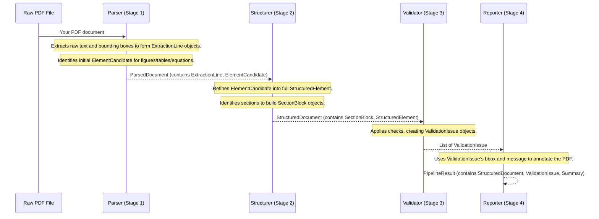

# Chapter 5: Document Data Models

Welcome back to the FixMyPaper journey! In [Chapter 4: PDF Processing Pipeline](04_pdf_processing_pipeline_.md), we explored how FixMyPaper takes your raw PDF and runs it through a sophisticated "assembly line" to extract information, apply checks, and generate reports. But how does this "assembly line" understand and pass along all that extracted information—like text, figures, tables, and detected issues—from one stage to the next?

Imagine trying to build a house without a blueprint, or a chef trying to share a complex recipe without standardized measurements. Chaos would quickly ensue! Similarly, for FixMyPaper to work smoothly, every part of the system needs a clear, standardized way to describe and store all the data it extracts and analyzes.

That's where **Document Data Models** come in!

## 5.1 What Are Document Data Models? The Standardized Blueprint

At its heart, FixMyPaper deals with a lot of different pieces of information from a document: where a specific line of text is, what a figure's caption says, whether an abstract has too few words, or the location of a missing section. If each part of our system stored this information in its own unique way, it would be like everyone speaking a different language.

**Document Data Models** are like the universal blueprints or standardized forms for all this information. They define:
*   **Precisely what information** should be collected (e.g., a figure needs a label, a number, a page, and its location).
*   **How that information should be structured** (e.g., coordinates for a bounding box should be four numbers: x0, y0, x1, y1).
*   **What type of data** each piece of information is (e.g., a page number is always a whole number, text is always a string).

**What problem do they solve?** These models ensure that all components of the FixMyPaper backend "speak the same language" when handling document data. This promotes **consistency**, **clarity**, and makes it much easier to build, maintain, and expand the system. It's like having standardized forms for recording every piece of information, ensuring uniformity.

Let's consider our central use case for the [PDF Processing Pipeline](04_pdf_processing_pipeline_.md) again: **A student uploads a research paper PDF, and the pipeline analyzes it and produces a report highlighting formatting issues and an annotated PDF.** The data models are what make this entire process consistent and readable at every step.

## 5.2 Pydantic: Our Blueprint Tool

In FixMyPaper, we use a powerful Python library called **Pydantic** to define our Document Data Models. Pydantic allows us to create Python classes that automatically:
*   **Enforce data types:** If you say something should be a number, Pydantic makes sure it is.
*   **Validate data:** It checks if the data fits the defined structure.
*   **Convert to/from JSON:** This is super helpful for sending data between our [Backend API Service](03_backend_api_service_.md) and other parts of the system.

You can find all our core data models in the file `backend/validation_models.py`.

## 5.3 Key Data Models in FixMyPaper

Let's look at some of the most important blueprints that FixMyPaper uses to understand your paper.

### 5.3.1 BoundingBox: Where Things Are

Almost everything important in a PDF has a location. A **BoundingBox** is our most basic blueprint for defining a rectangular area on a page.

```python
# backend/validation_models.py (simplified)
from pydantic import BaseModel

class BoundingBox(BaseModel):
    x0: float # The X-coordinate of the top-left corner
    y0: float # The Y-coordinate of the top-left corner
    x1: float # The X-coordinate of the bottom-right corner
    y1: float # The Y-coordinate of the bottom-right corner

    def as_tuple(self) -> tuple[float, float, float, float]:
        # A helpful function to get coordinates as a simple tuple
        return (self.x0, self.y0, self.x1, self.y1)
```
**Explanation:** This model tells us that a `BoundingBox` *must* have four floating-point numbers (`x0`, `y0`, `x1`, `y1`) to define its corners. This is essential for marking errors on the PDF!

### 5.3.2 ExtractionLine: Text with Location

When FixMyPaper reads your PDF, it doesn't just get a giant block of text. It gets individual lines of text, and each line has a specific place on a specific page.

```python
# backend/validation_models.py (simplified)
# ...
class ExtractionLine(BaseModel):
    text: str # The actual text of the line
    page: int # The page number (e.g., 1, 2, 3)
    bbox: BoundingBox # Its exact location on that page
```
**Explanation:** An `ExtractionLine` blueprint ensures that every line of text we extract comes with its actual `text`, the `page` it's on, and its precise `bbox` (using our `BoundingBox` model).

### 5.3.3 SectionBlock: Document Sections

Academic papers are divided into sections like "Abstract," "Introduction," "References." The `SectionBlock` model helps us keep track of these.

```python
# backend/validation_models.py (simplified)
# ...
from typing import Optional

class SectionBlock(BaseModel):
    heading: str # The title of the section (e.g., "Abstract")
    page: int    # The page where this section starts
    bbox: Optional[BoundingBox] = None # Its location (optional, as some sections might span pages)
    content: str = "" # The text content within this section (might be filled later)
```
**Explanation:** This blueprint clearly states that a section has a `heading`, a `page` number, and an optional `bbox`. This allows the [PDF Processing Pipeline](04_pdf_processing_pipeline_.md) to identify if all [Mandatory Sections](02_validation_formats___checks_.md) are present.

### 5.3.4 StructuredElement: Figures, Tables, Equations

Figures, tables, and equations are crucial elements in a paper. The `StructuredElement` model provides a common structure for all of them.

```python
# backend/validation_models.py (simplified)
# ...
from typing import Literal, Optional, Dict, Any

class StructuredElement(BaseModel):
    kind: Literal["figure", "table", "equation"] # What kind of element it is
    label: str = "" # Its label (e.g., "Fig. 1", "TABLE II")
    number: Optional[int] = None # Its extracted number (e.g., 1, 2)
    page: int # The page it's on
    bbox: Optional[BoundingBox] = None # Its location
    text: str = "" # Any associated text (like a caption)
    metadata: Dict[str, Any] = Field(default_factory=dict) # Other details
```
**Explanation:** This model is generic. It uses `kind` to specify if it's a "figure", "table", or "equation". It ensures that each such element has a `label`, `number`, `page`, and `bbox`, making it easy to perform checks like "Figure Sequential Numbering."

### 5.3.5 StructuredDocument: The Whole Paper, Organized

After all the parsing and structuring (as seen in [Chapter 4: PDF Processing Pipeline](04_pdf_processing_pipeline_.md)), all the extracted and refined information about the entire paper is organized into a `StructuredDocument`. This is the complete, easy-to-read representation of your paper for the computer.

```python
# backend/validation_models.py (simplified)
# ...
class StructuredDocument(BaseModel):
    sections: Dict[str, SectionBlock] = Field(default_factory=dict) # All identified sections
    figures: List[StructuredElement] = Field(default_factory=list) # All figures
    tables: List[StructuredElement] = Field(default_factory=list) # All tables
    equations: List[StructuredElement] = Field(default_factory=list) # All equations
    raw_text: str = "" # The full text of the document
    lines: List[ExtractionLine] = Field(default_factory=list) # All extracted lines
    metadata: Dict[str, Any] = Field(default_factory=dict) # Title, authors, etc.
    # ... more fields like references, statistics, page_count ...
```
**Explanation:** This `StructuredDocument` is a comprehensive blueprint that brings together all the smaller models. It's the central repository of your paper's content, formatted in a way that is perfectly understandable for the validation stage.

### 5.3.6 ValidationIssue: The Problem Report

When an error is found, FixMyPaper needs a standardized way to report it. That's what `ValidationIssue` is for.

```python
# backend/validation_models.py (simplified)
# ...
class ValidationIssue(BaseModel):
    code: str # A unique ID for the type of check (e.g., "abstract_word_count")
    check_id: int # A unique ID for the specific check in the system
    check_name: str # Human-readable name (e.g., "Abstract Word Count")
    message: str # The error message (e.g., "Abstract is too short.")
    type: Literal["formatting", "structure"] # Category of the issue
    severity: Literal["warning", "error"] # How serious the issue is
    page: int # The page where the issue was found
    text: str = "" # The problematic text snippet
    bbox: Optional[BoundingBox] = None # Exact location of the issue
    element: Optional[str] = None # What element is affected (e.g., "abstract", "figure")
```
**Explanation:** This is the blueprint for every error FixMyPaper detects. It contains all the necessary details to display a clear report to the user and to highlight the error on the annotated PDF.

### 5.3.7 PipelineResult: The Final Output

Finally, after the entire [PDF Processing Pipeline](04_pdf_processing_pipeline_.md) has run, all the results are packaged into a `PipelineResult` object, which is then sent back to the [Backend API Service](03_backend_api_service_.md).

```python
# backend/validation_models.py (simplified)
# ...
from datetime import datetime

class PipelineResult(BaseModel):
    job_id: str = "" # Unique ID for this processing job
    original_filename: str = "" # Name of the uploaded file
    output_path: str = "" # Path to the generated annotated PDF
    success: bool = True # Did the pipeline run successfully?
    # summary: ValidationSummary # A summary of errors
    errors: List[ValidationIssue] = Field(default_factory=list) # All detected issues
    document: StructuredDocument # The complete structured view of the document
    # ... more fields like statistics, reference_analysis, processed_at ...
```
**Explanation:** This is the ultimate "report card" for your paper. It ties together the `StructuredDocument` with all the `ValidationIssue`s, paths to the annotated PDF, and overall status, ready to be sent to the frontend.

## 5.4 How Data Models Guide the Pipeline

Let's visualize how these models are used through the [PDF Processing Pipeline](04_pdf_processing_pipeline_.md):


**Explanation:**
1.  The **Parser** reads the raw PDF and immediately starts creating `BoundingBox` and `ExtractionLine` objects for text, and `ElementCandidate` objects for potential figures/tables. These are all packaged into a `ParsedDocument`.
2.  The **Structurer** then takes this `ParsedDocument` and refines it, converting `ElementCandidate`s into proper `StructuredElement`s (with verified numbers) and identifying `SectionBlock`s. All this forms the `StructuredDocument`.
3.  The **Validator** receives the `StructuredDocument` and applies all the [Validation Formats & Checks](02_validation_formats___checks_.md). For every rule that's broken, it creates a `ValidationIssue` object.
4.  The **Reporter** takes these `ValidationIssue`s and uses their `bbox`, `page`, and `message` to draw highlights and pop-up notes on a new annotated PDF. Finally, all the results are combined into a `PipelineResult`.

## 5.5 Why Document Data Models Are So Important

Using these structured data models offers huge advantages:

| Benefit            | Description                                                                                                                                                                                                                                                                         |
| :----------------- | :---------------------------------------------------------------------------------------------------------------------------------------------------------------------------------------------------------------------------------------------------------------------------------- |
| **Consistency**    | Ensures that every part of FixMyPaper handles and understands document data in the exact same way. No ambiguity.                                                                                                                                                                      |
| **Clarity**        | Developers can quickly understand what data is available and how it's organized just by looking at the model definitions. It's self-documenting.                                                                                                                                     |
| **Validation**     | Pydantic automatically checks if data conforms to the defined types and structures, catching many bugs early. If the parser returns a page number as text instead of an integer, Pydantic will flag it immediately.                                                                    |
| **Maintainability**| When adding new features or modifying existing ones (e.g., adding a new check), it's much easier because the data structure is clearly defined and stable.                                                                                                                        |
| **API Integration**| Pydantic models are seamlessly integrated with FastAPI (our [Backend API Service](03_backend_api_service_.md)), which automatically generates interactive API documentation. This makes it easy for the frontend to know what data to send and expect.                                |

## 5.6 Conclusion

In this chapter, we've uncovered the essential role of **Document Data Models** in FixMyPaper. We learned that these standardized blueprints, built with Pydantic, define how all the complex information extracted from a PDF—from bounding boxes to entire structured documents and validation issues—is organized and communicated throughout the system. These models ensure consistency, clarity, and enable robust validation, making the entire FixMyPaper pipeline efficient and reliable.

With a solid understanding of how FixMyPaper processes and represents document data, we're now ready to look at how all these powerful components are packaged and made available for you to use. In the next chapter, we'll dive into [Containerization & Deployment](06_containerization___deployment_.md).

[Chapter 6: Containerization & Deployment](06_containerization___deployment_.md)

---
