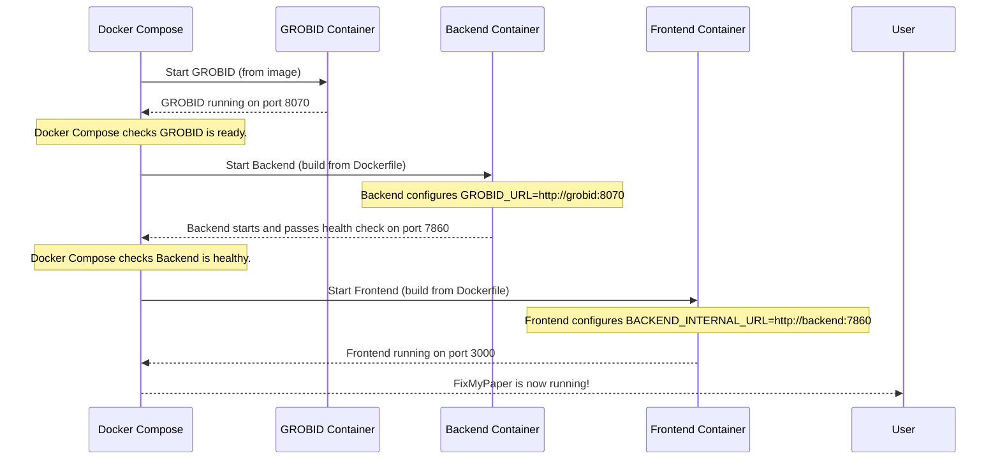

# Chapter 6: Containerization & Deployment

Welcome back to the FixMyPaper journey! In our previous chapters, we've dissected the intricate parts of our application: from the user-friendly [Frontend Web Application (FixMyPaper UI)](01_frontend_web_application__fixmypaper_ui__.md) to the complex [PDF Processing Pipeline](04_pdf_processing_pipeline__.md) and the structured [Document Data Models](05_document_data_models__.md) that bind it all together. You've seen how all these components work together conceptually.

But here's a crucial question: How do we take all these different pieces—written in different languages (Python for backend, JavaScript for frontend) with their own dependencies—and make them run together seamlessly and reliably on *any* server, without complicated setup?

Imagine you've built a magnificent Lego castle, complete with towers, drawbridges, and miniature figures. Now, you need to move it from your workshop to a new display shelf or even someone else's house. You can't just pick it up; it's fragile, and pieces might fall off. You need a way to carefully pack it, ensure all its parts are secure, and then easily set it up again in its new location.

This is exactly the problem **Containerization & Deployment** solves for FixMyPaper! It's about taking our entire application—frontend, backend, and all their supporting tools—and packaging them into standardized, isolated "boxes" that can be easily moved and run anywhere. This ensures our application runs reliably, consistently, and without conflicts, regardless of the underlying server.

Our central goal for this chapter is to understand: **How can we package the FixMyPaper application into these standardized "boxes" and then set them up to run on a server with minimal fuss?**

## 6.1 What is Containerization? (Think Standardized Moving Boxes)

At its core, **containerization** is a way to bundle an application and all its ingredients (code, libraries, settings, operating system parts) into a single, self-contained unit called a **container**.

Think of it like this:
*   **Without containers:** You're baking a cake. You need flour, sugar, eggs, a specific oven, and precise temperatures. If you try to bake it in someone else's kitchen, they might have different ingredients, a different oven, or even a different language on their recipe book. It's hard to guarantee the same result.
*   **With containers (Docker):** You pre-bake your cake in your oven, then put the *entire cake* (oven, ingredients, and all) into a standardized, sealed box. This box has clear labels and instructions. Now, anyone can just take your sealed box and "run" your cake, knowing it will be exactly as you intended, no matter their kitchen.

The most popular tool for containerization is **Docker**.

### 6.1.1 Dockerfiles: The Packing Instructions

Before you can have a "container" (the running application), you need a "Docker Image" (the packed box). A **Dockerfile** is like the instruction manual for building that packed box. It's a simple text file that tells Docker *exactly* how to assemble an application's environment.

Each service in FixMyPaper (frontend, backend) has its own Dockerfile.

Let's look at a simplified `Dockerfile.backend` for our [Backend API Service](03_backend_api_service__.md):

```dockerfile
# Dockerfile.backend (simplified)
FROM python:3.11-slim-bookworm # Start with a basic Python environment

WORKDIR /app # Set the working directory inside the container

COPY requirements.txt . # Copy the list of Python dependencies
RUN pip install --no-cache-dir -r requirements.txt # Install Python libraries

COPY backend ./backend # Copy our backend Python code
EXPOSE 7860 # Tell Docker this container will listen on port 7860
CMD ["gunicorn", "--worker-class", "uvicorn.workers.UvicornWorker", "--bind", "0.0.0.0:7860", "backend.app:app"] # Command to start the backend
```
**Explanation:**
*   `FROM python:3.11-slim-bookworm`: This line says, "Start with a pre-made lightweight Python 3.11 image." This is our base ingredient.
*   `WORKDIR /app`: All subsequent commands will run inside a folder named `/app` within the container.
*   `COPY requirements.txt .`: Copies the file listing Python packages needed by the backend.
*   `RUN pip install ...`: Installs all those Python packages.
*   `COPY backend ./backend`: Copies all our backend application code into the `/app/backend` folder.
*   `EXPOSE 7860`: Declares that the backend service inside the container will use port `7860`.
*   `CMD [...]`: This is the command that runs when the container starts. It kicks off our FastAPI backend using `gunicorn` and `uvicorn`.

Similarly, for our [Frontend Web Application (FixMyPaper UI)](01_frontend_web_application__fixmypaper_ui__.md), we have `frontend/Dockerfile`:

```dockerfile
# frontend/Dockerfile (simplified - uses "multi-stage build" for efficiency)
FROM node:18-alpine AS builder # Stage 1: For building the frontend
WORKDIR /app
COPY package*.json ./
RUN npm ci # Install Node.js dependencies
COPY . .
RUN npm run build # Build the Next.js application

FROM node:18-alpine AS runner # Stage 2: For running the built frontend
WORKDIR /app
COPY --from=builder /app/package*.json ./
RUN npm ci --omit=dev # Only install runtime dependencies, not development ones
COPY --from=builder /app/.next ./.next # Copy the built application
COPY --from=builder /app/public ./public
EXPOSE 3000 # Frontend will listen on port 3000
CMD ["npm", "run", "start"] # Command to start the frontend
```
**Explanation:**
*   This uses a "multi-stage build." The first `FROM` (aliased as `builder`) builds the frontend application.
*   The second `FROM` (aliased as `runner`) then *only* copies the finished build artifacts from the `builder` stage. This keeps the final container image small and efficient.
*   It installs Node.js dependencies, builds the Next.js app, and then copies only the essential files to a new, smaller image.
*   `EXPOSE 3000`: Declares the frontend will use port `3000`.
*   `CMD ["npm", "run", "start"]`: Starts the Next.js frontend application.

### 6.1.2 Docker Images: The Packed Boxes

Once you run a Dockerfile, it creates a **Docker Image**. An image is like a complete, read-only snapshot or template of your application, packed with everything it needs. You can share these images with others, and they can be sure that when they "run" your image, they'll get the exact same application you built.

### 6.1.3 Docker Containers: The Running Application

A **Docker Container** is a running instance of a Docker Image. When you "start" an image, it becomes a container. It's a lightweight, isolated environment where your application runs without affecting the host system or other containers.

## 6.2 Docker Compose: The Moving Plan for Multiple Boxes

FixMyPaper isn't just one service; it's a collection of services:
*   The `frontend` web app.
*   The `backend` API service.
*   An external PDF parsing tool like `grobid` (used by the backend).

Running each of these as separate Docker containers and manually linking them would be cumbersome. This is where **Docker Compose** comes in!

**Docker Compose** is a tool that helps define and run multi-container Docker applications. It's like having a detailed moving plan that specifies:
*   Which boxes (containers) you have.
*   What each box contains (which image to use or how to build it).
*   How they connect to each other (e.g., the frontend needs to talk to the backend).
*   Any special setup for each box (e.g., environment variables, exposed ports).

We define this "moving plan" in a file called `docker-compose.yml`.

Here's a simplified `docker-compose.yml` for FixMyPaper:

```yaml
# docker-compose.yml (simplified)
services:
  grobid: # Our PDF structural parser
    image: lfoppiano/grobid:0.8.1 # Use a pre-built GROBID image
    ports:
      - "8070:8070" # Map host port 8070 to container port 8070

  backend: # Our Backend API Service
    build:
      context: . # Build from current directory
      dockerfile: Dockerfile.backend # Use our backend Dockerfile
    ports:
      - "5001:7860" # Map host port 5001 to container port 7860
    environment:
      PORT: "7860"
      GROBID_URL: http://grobid:8070 # How backend finds GROBID container
    depends_on:
      - grobid # Backend needs GROBID to be running
    healthcheck: # Checks if the backend is ready
      test: ["CMD", "python", "-c", "import urllib.request,sys; sys.exit(0) if urllib.request.urlopen('http://127.0.0.1:7860/health').getcode()==200 else sys.exit(1)"]
      interval: 30s
      timeout: 10s
      retries: 5
      start_period: 40s

  frontend: # Our Frontend Web Application
    build:
      context: ./frontend
      dockerfile: Dockerfile
      args:
        BACKEND_INTERNAL_URL: http://backend:7860 # How frontend finds backend container (at build time)
    ports:
      - "3000:3000" # Map host port 3000 to container port 3000
    environment:
      NODE_ENV: production
      BACKEND_INTERNAL_URL: http://backend:7860 # How frontend finds backend container (at runtime)
    depends_on:
      backend:
        condition: service_healthy # Frontend waits for backend to be healthy
```
**Explanation:**
*   `services:`: This is where we list all the independent applications that make up FixMyPaper.
*   `grobid:`: We simply use a pre-built Docker image for GROBID. It exposes port `8070`.
*   `backend:`:
    *   `build:`: Tells Docker Compose to build this service using `Dockerfile.backend`.
    *   `ports: - "5001:7860"`: This is crucial! It maps port `5001` on your *host machine* (the server) to port `7860` *inside* the backend container. So, you access the backend from your host at `localhost:5001`.
    *   `environment: GROBID_URL: http://grobid:8070`: This sets an environment variable inside the backend container, telling it where to find the `grobid` service (Docker Compose automatically sets up a network so `grobid` is a valid hostname).
    *   `depends_on: - grobid`: Ensures that the `grobid` container starts *before* the `backend` container.
    *   `healthcheck:`: Defines a command to check if the backend service inside the container is actually running and responsive.
*   `frontend:`:
    *   `build:`: Builds the frontend using `frontend/Dockerfile`.
    *   `args: BACKEND_INTERNAL_URL: http://backend:7860`: This passes an argument *during the build process* of the frontend, letting Next.js know the internal address of the backend.
    *   `ports: - "3000:3000"`: Maps host port `3000` to container port `3000`.
    *   `environment: BACKEND_INTERNAL_URL: http://backend:7860`: Passes the backend URL as an environment variable at *runtime*.
    *   `depends_on: backend: condition: service_healthy`: Ensures the frontend starts *only* after the backend is reported as `healthy` by its `healthcheck`.

This `docker-compose.yml` essentially describes how to set up our entire FixMyPaper "Lego castle" automatically.

### Simplified Startup Sequence with Docker Compose



## 6.3 Deployment: Getting FixMyPaper Running

Now that we understand containerization, let's see how we use these concepts to deploy FixMyPaper on a server. There are generally two main approaches:

1.  **Build and Publish Images (for CI/CD or staging):** Build the images once and store them in a central place.
2.  **Pull and Run Pre-built Images (for production deployment):** On the server, just download the pre-built images and run them.

### 6.3.1 Step 1: Building and Publishing Pre-built Images

Typically, you'd build and test your Docker images in a controlled environment (like a Continuous Integration server). Once they're ready, you "publish" them to an **Image Registry**. An Image Registry is like a public library or storage facility for Docker images. For FixMyPaper, we use `ghcr.io` (GitHub Container Registry).

We have scripts (`scripts/publish-images.sh` for Linux/macOS or `scripts/publish-images.ps1` for Windows) that automate this process.

Here's a simplified version of what `scripts/publish-images.sh` does:

```bash
#!/usr/bin/env bash
# scripts/publish-images.sh (simplified)

IMAGE_TAG="${IMAGE_TAG:-$(git rev-parse --short HEAD)}" # Get a unique tag from Git
REGISTRY="${REGISTRY:-ghcr.io}"
IMAGE_NAMESPACE="${IMAGE_NAMESPACE:-Eshwarsai-07}"

BACKEND_IMAGE="${REGISTRY}/${IMAGE_NAMESPACE}/fixmypaper-backend:${IMAGE_TAG}"
FRONTEND_IMAGE="${REGISTRY}/${IMAGE_NAMESPACE}/fixmypaper-frontend:${IMAGE_TAG}"

printf "\n[publish] Building backend image...\n"
docker buildx build \
  --platform "linux/amd64" \
  -f Dockerfile.backend \
  -t "${BACKEND_IMAGE}" \
  --push \
  . # Build and push backend image

printf "\n[publish] Building frontend image...\n"
docker buildx build \
  --platform "linux/amd64" \
  -f frontend/Dockerfile \
  --build-arg BACKEND_INTERNAL_URL="http://backend:7860" \
  -t "${FRONTEND_IMAGE}" \
  --push \
  ./frontend # Build and push frontend image
```
**Explanation:**
*   It determines a unique `IMAGE_TAG` (often based on the current code version).
*   It uses `docker buildx build` to build the images. `buildx` allows building for different computer architectures (like `linux/amd64`).
*   The `-f Dockerfile.backend` (or `frontend/Dockerfile`) specifies which Dockerfile to use.
*   `-t "${BACKEND_IMAGE}"`: Tags the image with a name like `ghcr.io/Eshwarsai-07/fixmypaper-backend:a1b2c3d`.
*   `--push`: This crucial flag *pushes* the newly built image to the specified Docker registry (`ghcr.io`).

After this script runs, our `fixmypaper-backend` and `fixmypaper-frontend` images are available in `ghcr.io`, ready to be downloaded by any server.

### 6.3.2 Step 2: Configuring the Server with `.env.server`

Before running the application on a server, we need to provide some configuration, like the exact names of the Docker images to use and other environment-specific settings. This is done using a `.env.server` file.

```env
# .env.server.example (simplified)
BACKEND_IMAGE=ghcr.io/Eshwarsai-07/fixmypaper-backend
FRONTEND_IMAGE=ghcr.io/Eshwarsai-07/fixmypaper-frontend
IMAGE_TAG=v1.0.0 # This should be set to the tag published in Step 1
REFERENCE_API_URL=http://host.docker.internal:8000/analyze
BACKEND_INTERNAL_URL=http://backend:7860
UPLOAD_PROXY_TIMEOUT_MS=900000
```
**Explanation:** This file contains variables that Docker Compose will use. `IMAGE_TAG` is particularly important, as it tells Docker Compose *which specific version* of our `fixmypaper-backend` and `fixmypaper-frontend` images to download from the registry.

### 6.3.3 Step 3: Pulling and Running Pre-built Images on the Server

On the actual deployment server, we don't need to rebuild anything. We just need to download (pull) the pre-built images from the registry and start them using Docker Compose.

The `scripts/deploy-prebuilt.sh` (or `.ps1`) automates this:

```bash
#!/usr/bin/env bash
# scripts/deploy-prebuilt.sh (simplified)

COMPOSE_FILE="${COMPOSE_FILE:-docker-compose.prebuilt.yml}" # Uses a version that references pre-built images
ENV_FILE="${ENV_FILE:-.env.server}"

printf "\n[deploy] Pulling images...\n"
docker compose --env-file "${ENV_FILE}" -f "${COMPOSE_FILE}" pull # Download images

printf "\n[deploy] Starting services...\n"
docker compose --env-file "${ENV_FILE}" -f "${COMPOSE_FILE}" up -d --remove-orphans --pull never # Start services

printf "\n[deploy] Service status:\n"
docker compose --env-file "${ENV_FILE}" -f "${COMPOSE_FILE}" ps # Check status
```
**Explanation:**
*   `docker compose --env-file "${ENV_FILE}" -f "${COMPOSE_FILE}" pull`: This command reads the `.env.server` file to get the image names and tags, and then downloads (pulls) those specific images from `ghcr.io`.
*   `docker compose ... up -d`: This starts all the services defined in `docker-compose.prebuilt.yml` in "detached" mode (`-d`), meaning they run in the background. `--remove-orphans` cleans up any old, unused containers, and `--pull never` ensures it uses only the locally pulled images.
*   `docker compose ... ps`: Shows the status of all running containers.

After these steps, FixMyPaper (frontend, backend, and GROBID) will be running on your server, accessible via the ports defined in `docker-compose.yml` (e.g., frontend on `localhost:3000`, backend on `localhost:5001`).

If you need to update FixMyPaper, you simply update the `IMAGE_TAG` in `.env.server` and re-run the `deploy-prebuilt.sh` script! Docker Compose will intelligently pull the new images and update the running containers.

### 6.3.4 Alternative: Direct Server Deployment (for Specific Environments)

Sometimes, especially in specific university or college server setups, using Docker Compose for the *main* application might not be the preferred way. For these cases, we also have a script (`scripts/deploy_college_server.sh`) that directly installs all necessary dependencies (Python, Node.js, system libraries), clones the repositories, and sets up each service (frontend, backend, reference-api) as system services using `systemd` and `nginx` for web traffic routing.

This approach is more tailored to traditional server management, installing everything directly on the host system. While it's an alternative to Dockerizing the main app, it achieves the same goal of getting FixMyPaper up and running reliably, just using different underlying tools for process management.

## 6.4 Conclusion

In this chapter, we've explored **Containerization & Deployment**, understanding how FixMyPaper transforms from a collection of code into a robust, portable application. We learned about:
*   **Dockerfiles** as the instruction manuals for building application environments.
*   **Docker Images** as the standardized, packed versions of our services.
*   **Docker Containers** as the running instances of these images.
*   **Docker Compose** as the orchestrator for running multiple interdependent services together.
*   The process of building, publishing, and deploying these containerized applications using `.env.server` and helper scripts.

This approach ensures that FixMyPaper can be deployed consistently and reliably on various servers, making it easy to manage and update. From the smallest `BoundingBox` to the full `PipelineResult`, and now to its complete, deployable form, you've seen the entire FixMyPaper project!

---